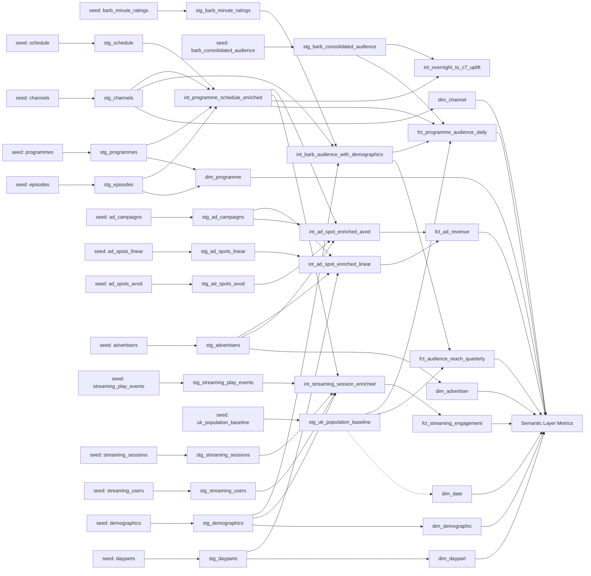

# MediaCo Media Analytics — Technical Design

> **Generated by:** dbt-architect | **Date:** 2026-05-27 | **Status:** Pending approval
> **Engine:** dbt Fusion (`latest-fusion`) | **Warehouse:** Snowflake (`zna84829` / `CCASTRO_SANDBOX`)
> **Governance tier:** `standard` (contracts enforced, PII classification, freshness, versioning)
> **Data strategy:** dbt seeds — no upstream warehouse tables

---

## 0. dbt Mesh Assessment

**Decision: SINGLE PROJECT (no Mesh / monorepo split).**

Rationale — none of the Mesh signals are present:

| Mesh signal | Present? | Notes |
|-------------|----------|-------|
| Multiple teams with separate ownership of layers | No | Standalone demo, single notional owner |
| Explicit access control across domains | No | RBAC in `requirements.md` is read-only on marts; not project-level isolation |
| Cross-domain versioned/contracted dependencies | No | All marts consumed by a single downstream surface (BI + Semantic Layer) |
| Regulatory provenance across domains | Partial | Ofcom reporting reads from marts, but does not require a separate project boundary |
| Stated as standalone demo by user | Yes | Confirmed input: "standalone demo repo, NOT a dbt Mesh multi-project setup" |

The four content domains (linear audience, advertising, digital/MediaCo Streaming, reach/Ofcom) share dimensions (`dim_programme`, `dim_channel`, `dim_demographic`, `dim_date`) and live under one repository, one CI pipeline, one dbt Platform project. Splitting into producer/consumer projects would add governance overhead with no team-boundary benefit.

Project layout:

```
/tmp/media_company_demo/
├── dbt_project.yml
├── packages.yml
├── seeds/                              ← 15 CSVs (source data)
│   └── _seeds.yml
├── models/
│   ├── staging/
│   │   ├── _sources.yml
│   │   ├── _stg_models.yml
│   │   └── stg_*.sql                   ← 15 staging models (view)
│   ├── intermediate/
│   │   ├── _int_models.yml
│   │   └── int_*.sql                   ← 6 intermediate models (view)
│   ├── marts/
│   │   ├── _marts_models.yml           ← contracts enforced
│   │   ├── fct_*.sql                   ← 4 fact models (table / cluster by)
│   │   └── dim_*.sql                   ← 6 dimension models (table)
│   └── semantic/
│       └── _semantic_models.yml        ← semantic models + metrics
├── macros/
│   └── generate_schema_name.sql        ← standard override (custom > target)
└── specs/media_company-media-analytics/
```

---

## 1. DAG (Directed Acyclic Graph)



---

## 2. Source Contracts

**Data strategy:** all source data comes from CSV seeds committed under `seeds/`. There are no upstream warehouse tables. Sources are declared in `models/staging/_sources.yml` and resolve via dbt vars to the seed-loading schema.

**Project vars (set in `dbt_project.yml`):**

```yaml
vars:
  source_database: "CCASTRO_SANDBOX"
  source_schema_prefix: "dbt_media_company_demo_source"
  underdelivery_threshold: 0.95
  uk_population_thousands: 63000
```

**Seeds config (set in `dbt_project.yml`):**

```yaml
seeds:
  media_company_demo:
    +schema: dbt_media_company_demo_source        # seeds materialize into CCASTRO_SANDBOX.dbt_media_company_demo_source
    +quote_columns: false
```

**Schema-name macro (`macros/generate_schema_name.sql`):** standard dbt override — `custom_schema_name` wins over `target.schema` so seeds land in `dbt_media_company_demo_source` regardless of the active target schema (`dbt_media_company_demo_dev` / `dbt_media_company_demo_staging` / `dbt_media_company_demo_prod`).

**Source YAML (`models/staging/_sources.yml`):**

```yaml
version: 2

sources:
  - name: media_raw
    database: "{{ var('source_database') }}"
    schema: "{{ var('source_schema_prefix') }}"
    description: "Raw media data loaded as dbt seeds (BARB-style, MediaCo Streaming, ad ops)"
    freshness:
      warn_after: {count: 36, period: hour}
      error_after: {count: 72, period: hour}
    loaded_at_field: _loaded_at         # set in seed CSVs or via post-hook
    tables:
      - name: barb_minute_ratings
      - name: barb_consolidated_audience
      - name: programmes
      - name: episodes
      - name: schedule
      - name: channels
      - name: ad_campaigns
      - name: ad_spots_linear
      - name: ad_spots_avod
      - name: advertisers
      - name: streaming_play_events
      - name: streaming_sessions
      - name: streaming_users
      - name: demographics
      - name: dayparts
      - name: uk_population_baseline    # NEW — derived from CA-01
```

Note: `uk_population_baseline.csv` is added to satisfy CA-01 (UK population must come from a versioned seed, not be hardcoded). Total: **16 seed tables** (15 from requirements + 1 baseline).

---

## 3. Staging Layer (`models/staging/`)

All staging models materialize as `view`. Each does the minimum: rename to snake_case, cast types, add `_loaded_at = current_timestamp()`. No business logic, no joins.

| Staging model | Source seed | Grain | Notable casts / renames |
|---------------|-------------|-------|--------------------------|
| `stg_barb_minute_ratings` | `media_raw.barb_minute_ratings` | 1 row per channel × programme × broadcast_minute × demographic | `broadcast_date::date`, `viewers_thousands::number(12,2)`, `tvr_pct::number(6,3)` |
| `stg_barb_consolidated_audience` | `media_raw.barb_consolidated_audience` | 1 row per programme × channel × broadcast_date | `overnight_viewers_thousands`, `c7_viewers_thousands::number(12,2)` |
| `stg_programmes` | `media_raw.programmes` | 1 row per `programme_id` | `is_original_uk::boolean`, `is_news_current_affairs::boolean`, `duration_min::integer` |
| `stg_episodes` | `media_raw.episodes` | 1 row per `episode_id` | `first_tx_date::date` |
| `stg_schedule` | `media_raw.schedule` | 1 row per channel × broadcast_date × start_time | `start_time::timestamp_ntz`, `end_time::timestamp_ntz` |
| `stg_channels` | `media_raw.channels` | 1 row per `channel_id` | `is_media_company_portfolio::boolean`, `is_psb::boolean` |
| `stg_ad_campaigns` | `media_raw.ad_campaigns` | 1 row per `campaign_id` | `total_budget_gbp::number(14,2)`, `start_date::date` |
| `stg_ad_spots_linear` | `media_raw.ad_spots_linear` | 1 row per `spot_id` | `airing_time::timestamp_ntz`, `booked_impressions_thousands`, `delivered_impressions_thousands::number(14,2)`, `rate_card_cpm_gbp`, `actual_revenue_gbp::number(14,2)` |
| `stg_ad_spots_avod` | `media_raw.ad_spots_avod` | 1 row per `impression_id` | `served_at::timestamp_ntz`, `revenue_gbp::number(14,4)` |
| `stg_advertisers` | `media_raw.advertisers` | 1 row per `advertiser_id` | trim names, lower-case sector |
| `stg_streaming_play_events` | `media_raw.streaming_play_events` | 1 row per play event | `event_timestamp::timestamp_ntz`, `event_type::varchar` (enum), `position_sec::integer` |
| `stg_streaming_sessions` | `media_raw.streaming_sessions` | 1 row per `session_id` | `session_start`, `session_end::timestamp_ntz`, `is_new_user::boolean` |
| `stg_streaming_users` | `media_raw.streaming_users` | 1 row per `user_id` | `registration_date::date`, `is_active::boolean` |
| `stg_demographics` | `media_raw.demographics` | 1 row per `demographic_id` | enum casts on `age_band`, `gender`, `social_grade` |
| `stg_dayparts` | `media_raw.dayparts` | 1 row per `daypart_id` | `start_hour`, `end_hour::integer` |
| `stg_uk_population_baseline` | `media_raw.uk_population_baseline` | 1 row per (year, demographic_id) | `population_thousands::integer` |

**Tests (PK / FK / not_null) live in `_stg_models.yml`** — written by `dbt-developer` at creation time:

- `not_null` on every primary key column
- `unique` on primary key columns for entity tables (programmes, episodes, channels, advertisers, campaigns, demographics, dayparts, streaming_users, streaming_sessions)
- `relationships` on every FK to the corresponding staging model

---

## 4. Intermediate Layer (`models/intermediate/`)

All intermediate models materialize as `view`. They encode joins and business logic that is reused across multiple marts. Per-mart-only logic stays in the mart.

### `int_programme_schedule_enriched`
- **Grain:** 1 row per channel × broadcast_date × start_time
- **Inputs:** `stg_schedule`, `stg_programmes`, `stg_episodes`, `stg_channels`
- **Logic:**
  - Join schedule → programmes (programme metadata) → episodes (episode metadata) → channels (broadcaster, PSB flag)
  - Derive `slot_duration_min` from `end_time - start_time`
  - Derive `broadcast_hour` from `start_time` (for daypart join downstream)
  - Flag `is_simulcast` when schedule row exists in both linear and MediaCo Streaming (not in scope for seed v1 — column left as `false`)

### `int_barb_audience_with_demographics`
- **Grain:** 1 row per channel × programme × broadcast_date × demographic_id (daily roll-up of minute ratings)
- **Inputs:** `stg_barb_minute_ratings`, `stg_demographics`, `stg_channels`
- **Logic:**
  - Aggregate minute-level ratings to daily: `AVG(tvr_pct)` weighted by minute, `AVG(viewers_thousands)` for the programme slot
  - Compute `programme_minutes_viewed = SUM(viewers_thousands) over minutes`
  - Compute `consecutive_15min_viewers_thousands` flag for reach (CA-04) — using a window function to detect 15-minute consecutive runs per (programme, channel, demographic)
  - Join demographic attributes and channel attributes
- **Reused by:** `fct_programme_audience_daily`, `fct_audience_reach_quarterly`

### `int_ad_spot_enriched_linear`
- **Grain:** 1 row per `spot_id`
- **Inputs:** `stg_ad_spots_linear`, `stg_advertisers`, `stg_ad_campaigns`, `stg_dayparts`
- **Logic:**
  - Join spot → campaign → advertiser
  - Resolve `daypart_id` from `airing_time` by matching hour into `stg_dayparts` (between start_hour and end_hour)
  - Compute `spot_delivery_ratio = delivered_impressions_thousands / nullif(booked_impressions_thousands, 0)`
  - Compute `realised_cpm_gbp = (actual_revenue_gbp / nullif(delivered_impressions_thousands, 0))` (already per thousand)
  - Flag `is_under_delivered = spot_delivery_ratio < {{ var('underdelivery_threshold') }}`
  - Add `platform = 'linear'`

### `int_ad_spot_enriched_avod`
- **Grain:** 1 row per programme × campaign × broadcast_date (daily aggregate — confirmed by user)
- **Inputs:** `stg_ad_spots_avod`, `stg_advertisers`, `stg_ad_campaigns`, `int_programme_schedule_enriched` (for programme metadata / broadcast_date alignment)
- **Logic:**
  - Aggregate raw impression-level seeds to daily: `COUNT(impression_id) / 1000 AS impressions_thousands`, `SUM(revenue_gbp) AS actual_revenue_gbp`, by (programme_id, campaign_id, served_at::date)
  - Compute `realised_cpm_gbp = (actual_revenue_gbp / nullif(impressions_thousands, 0))`
  - Booked impressions for AVOD come from `stg_ad_campaigns` (campaign-level booking allocated pro-rata — documented as a demo simplification)
  - Compute `spot_delivery_ratio` against the campaign-level booked allocation
  - Add `platform = 'avod'`, `daypart = NULL` (AVOD is daypart-agnostic — documented)

### `int_streaming_session_enriched`
- **Grain:** 1 row per session × programme (one session can play multiple programmes)
- **Inputs:** `stg_streaming_sessions`, `stg_streaming_users`, `stg_demographics`, `stg_streaming_play_events`, `int_programme_schedule_enriched`
- **Logic:**
  - Join session → user → demographic
  - Aggregate play events per session × programme: `video_starts = COUNT(event_type='start')`, `video_completes = COUNT(event_type='complete')`, `session_duration_min = (MAX(event_timestamp) - MIN(event_timestamp)) / 60`
  - Exclude programmes with `duration_min < 5` (CA-09 — avoid trailers/promos skewing completion rate)
  - Derive `completion_rate = video_completes / nullif(video_starts, 0)`
  - Carry `is_new_user`, `platform`, `device_type` from session

### `int_overnight_to_c7_uplift`
- **Grain:** 1 row per programme_id (latest broadcast)
- **Inputs:** `stg_barb_consolidated_audience`, `int_programme_schedule_enriched` (for genre)
- **Logic:**
  - For each programme with both overnight and C7 figures available: `c7_uplift_pct = (c7_viewers_thousands - overnight_viewers_thousands) / nullif(overnight_viewers_thousands, 0)`
  - Join programme genre for downstream genre-level analysis (BQ-12)
  - Filter to rows where `current_date - broadcast_date >= 8` (CA-02: C7 only fully consolidated after TX+8)

---

## 5. Marts Layer (`models/marts/`)

### Fact tables

#### `fct_programme_audience_daily`
- **Grain:** 1 row per `programme_id × channel_id × broadcast_date × demographic_id`
- **Materialization:** `table`, `cluster by (broadcast_date, channel_id)`
- **Inputs:** `int_barb_audience_with_demographics`, `int_programme_schedule_enriched`, `stg_barb_consolidated_audience`, `stg_uk_population_baseline`
- **Columns:**

| Column | Type | Description | Classification |
|--------|------|-------------|----------------|
| `programme_audience_daily_id` | string | Surrogate `md5(programme_id‖channel_id‖broadcast_date‖demographic_id)` (PK) | internal |
| `programme_id` | string | FK → `dim_programme` | internal |
| `channel_id` | string | FK → `dim_channel` | internal |
| `broadcast_date` | date | UK broadcast date | internal |
| `demographic_id` | string | FK → `dim_demographic` | internal |
| `tvr_pct` | number(6,3) | `(viewers_thousands / uk_population_thousands) * 100` (CA-01) | internal |
| `overnight_viewers_thousands` | number(12,2) | From `stg_barb_consolidated_audience` | internal |
| `c7_viewers_thousands` | number(12,2) | NULL until TX+8 (CA-02) | internal |
| `is_c7_consolidated` | boolean | True when `c7_viewers_thousands IS NOT NULL` (CA-02) | internal |
| `share_of_viewing_pct` | number(6,3) | `channel_viewing_minutes / total_uk_viewing_minutes_in_window` (CA-03) | internal |
| `reach_15min_thousands` | number(12,2) | Distinct viewers ≥15 consecutive minutes (CA-04) | internal |
| `_dbt_updated_at` | timestamp | Audit | internal |

#### `fct_ad_revenue`
- **Grain:** 1 row per `channel_id × advertiser_id × campaign_id × daypart_id × broadcast_date × platform`
- **Materialization:** `table`, `cluster by (broadcast_date, advertiser_id)`
- **Inputs:** `int_ad_spot_enriched_linear`, `int_ad_spot_enriched_avod` (UNION ALL)
- **Note:** Linear feeds rows with real `daypart_id`; AVOD feeds rows with `daypart_id = 'all_day'` (sentinel — documented in glossary)
- **Columns:**

| Column | Type | Description | Classification |
|--------|------|-------------|----------------|
| `ad_revenue_id` | string | Surrogate PK | internal |
| `channel_id` | string | FK (NULL for AVOD; pinned to 'streaming' sentinel) | internal |
| `advertiser_id` | string | FK → `dim_advertiser` | internal |
| `campaign_id` | string | Campaign identifier | confidential |
| `daypart_id` | string | FK → `dim_daypart` | internal |
| `broadcast_date` | date | UK broadcast date | internal |
| `platform` | string | enum: `linear` \| `avod` | internal |
| `impressions_thousands` | number(14,2) | Delivered impressions (CA-05/CA-06) | confidential |
| `booked_impressions_thousands` | number(14,2) | Booked target (CA-07) | confidential |
| `actual_revenue_gbp` | number(14,2) | Gross GBP revenue (CA-05) | confidential |
| `rate_card_cpm_gbp` | number(8,2) | Rate-card CPM (yield baseline) | confidential |
| `realised_cpm_gbp` | number(8,2) | `actual_revenue_gbp / impressions_thousands` (CA-06) | confidential |
| `spot_delivery_ratio` | number(6,3) | `delivered / booked` (CA-07) | internal |
| `is_under_delivered` | boolean | `spot_delivery_ratio < var('underdelivery_threshold')` | internal |
| `_dbt_updated_at` | timestamp | Audit | internal |

#### `fct_streaming_engagement`
- **Grain:** 1 row per `session_id × programme_id × broadcast_date`
- **Materialization:** `table`, `cluster by (broadcast_date, platform)`
- **Inputs:** `int_streaming_session_enriched`
- **Columns:**

| Column | Type | Description | Classification |
|--------|------|-------------|----------------|
| `streaming_engagement_id` | string | Surrogate PK | internal |
| `session_id` | string | FK → MediaCo Streaming session | confidential (linked to pseudonymous user) |
| `user_id` | string | Pseudonymous user_id (NULL for anonymous) | confidential |
| `programme_id` | string | FK → `dim_programme` | internal |
| `broadcast_date` | date | Date of the session | internal |
| `platform` | string | enum: `web` \| `ios` \| `android` \| `ctv` | internal |
| `device_type` | string | Device descriptor | internal |
| `session_duration_min` | number(8,2) | (CA-08 supports) | internal |
| `video_starts` | integer | Count of `start` events | internal |
| `video_completes` | integer | Count of `complete` events | internal |
| `completion_rate` | number(6,3) | (CA-09) | internal |
| `is_new_user` | boolean | First-time user flag (CA-08) | internal |
| `_dbt_updated_at` | timestamp | Audit | internal |

#### `fct_audience_reach_quarterly`
- **Grain:** 1 row per `channel_id × demographic_id × broadcast_quarter`
- **Materialization:** `table`, `cluster by (broadcast_quarter, channel_id)`
- **Inputs:** `int_barb_audience_with_demographics`, `stg_uk_population_baseline`
- **Columns:**

| Column | Type | Description | Classification |
|--------|------|-------------|----------------|
| `audience_reach_quarterly_id` | string | Surrogate PK | internal |
| `channel_id` | string | FK → `dim_channel` | internal |
| `demographic_id` | string | FK → `dim_demographic` | internal |
| `broadcast_quarter` | string | UK broadcast quarter (e.g. `2026Q1`) | internal |
| `reach_thousands` | number(14,2) | Distinct viewers ≥15 consecutive minutes (CA-04) | internal |
| `reach_pct_uk_population` | number(6,3) | `reach_thousands / uk_population_thousands * 100` | internal |
| `is_15min_consecutive` | boolean | Always `true` for Ofcom-format rows | internal |
| `_dbt_updated_at` | timestamp | Audit | internal |

### Dimension tables

#### `dim_programme`
- **Materialization:** `table`
- **Inputs:** `stg_programmes`, `stg_episodes` (latest series/episode counts via aggregate)
- **Columns:** `programme_id` (PK), `title`, `genre`, `sub_genre`, `is_original_uk`, `is_news_current_affairs`, `duration_min`, `latest_series_number`, `episode_count`

#### `dim_channel`
- **Materialization:** `table`
- **Inputs:** `stg_channels`
- **Columns:** `channel_id` (PK), `channel_name`, `broadcaster`, `is_media_company_portfolio`, `is_psb`

#### `dim_advertiser`
- **Materialization:** `table`
- **Inputs:** `stg_advertisers`
- **Columns:** `advertiser_id` (PK), `advertiser_name`, `sector`, `agency`

#### `dim_demographic`
- **Materialization:** `table`
- **Inputs:** `stg_demographics`
- **Columns:** `demographic_id` (PK), `age_band`, `gender`, `social_grade`

#### `dim_daypart`
- **Materialization:** `table`
- **Inputs:** `stg_dayparts`
- **Columns:** `daypart_id` (PK), `daypart_name`, `start_hour`, `end_hour`, `is_peak`

#### `dim_date`
- **Materialization:** `table`
- **Inputs:** generated via `dbt_utils.date_spine` 2020-01-01 → 2027-12-31
- **Columns:** `date_day` (PK), `day_of_week`, `iso_week`, `calendar_month`, `calendar_quarter`, `calendar_year`, `broadcast_week_start` (Monday-start), `broadcast_month` (4-4-5 convention — CA-13), `broadcast_quarter`, `is_weekend`, `is_uk_bank_holiday`

---

## 6. Data Classification Summary

All staging models inherit `internal` by default. PII or confidential exposure surfaces in marts where business-meaningful joins occur.

| Model | PII columns | Confidential columns | Masking required |
|-------|-------------|----------------------|------------------|
| `fct_programme_audience_daily` | — | — | No |
| `fct_ad_revenue` | — | `campaign_id`, `impressions_thousands`, `booked_impressions_thousands`, `actual_revenue_gbp`, `rate_card_cpm_gbp`, `realised_cpm_gbp` | No (no direct PII; commercial confidentiality only) |
| `fct_streaming_engagement` | — | `user_id` (pseudonymous), `session_id` | No — pseudonymous; CA-08 / requirements §5 confirms PII is out of scope |
| `fct_audience_reach_quarterly` | — | — | No |
| `dim_programme` | — | — | No |
| `dim_channel` | — | — | No |
| `dim_advertiser` | — | `sector`, `agency` (commercially sensitive when linked to revenue) | No |
| `dim_demographic` | — | — | No |
| `dim_daypart` | — | — | No |
| `dim_date` | — | — | No |

Per requirements §5: "PII handling beyond pseudonymous user IDs" is out of scope. No columns warrant `pii` classification; `user_id` and `session_id` are pseudonymous and flagged as `confidential`.

---

## 7. Model Contracts (governance tier: standard)

All mart models have `contract.enforced: true`. PK columns carry `not_null` + `unique` constraints. Enum columns carry `accepted_values` data tests in YAML.

Example — `fct_ad_revenue`:

```yaml
models:
  - name: fct_ad_revenue
    access: protected
    config:
      contract:
        enforced: true
    columns:
      - name: ad_revenue_id
        data_type: string
        constraints:
          - type: not_null
          - type: unique
        meta:
          classification: internal
      - name: channel_id
        data_type: string
        meta:
          classification: internal
      - name: advertiser_id
        data_type: string
        constraints:
          - type: not_null
        meta:
          classification: internal
      - name: campaign_id
        data_type: string
        meta:
          classification: confidential
      - name: daypart_id
        data_type: string
        meta:
          classification: internal
      - name: broadcast_date
        data_type: date
        constraints:
          - type: not_null
        meta:
          classification: internal
      - name: platform
        data_type: string
        constraints:
          - type: not_null
        tests:
          - accepted_values:
              values: ['linear', 'avod']
        meta:
          classification: internal
      - name: impressions_thousands
        data_type: number(14,2)
        meta:
          classification: confidential
      - name: booked_impressions_thousands
        data_type: number(14,2)
        meta:
          classification: confidential
      - name: actual_revenue_gbp
        data_type: number(14,2)
        meta:
          classification: confidential
      - name: rate_card_cpm_gbp
        data_type: number(8,2)
        meta:
          classification: confidential
      - name: realised_cpm_gbp
        data_type: number(8,2)
        meta:
          classification: confidential
      - name: spot_delivery_ratio
        data_type: number(6,3)
        meta:
          classification: internal
      - name: is_under_delivered
        data_type: boolean
        meta:
          classification: internal
      - name: _dbt_updated_at
        data_type: timestamp
        meta:
          classification: internal
```

Equivalent contracts apply to `fct_programme_audience_daily`, `fct_streaming_engagement`, `fct_audience_reach_quarterly`, and all six `dim_*` models. Enum `accepted_values` tests are required on:

| Model | Column | Accepted values |
|-------|--------|-----------------|
| `fct_ad_revenue` | `platform` | `linear`, `avod` |
| `fct_streaming_engagement` | `platform` | `web`, `ios`, `android`, `ctv` |
| `dim_demographic` | `gender` | `M`, `F` (per requirements §3 — no third option in BARB seed) |
| `dim_demographic` | `social_grade` | `ABC1`, `C2DE` |
| `dim_demographic` | `age_band` | `4-15`, `16-34`, `35-54`, `55+` |
| `dim_daypart` | `daypart_name` | `breakfast`, `daytime`, `pre-peak`, `peak`, `post-peak`, `night` |
| `dim_channel` | `broadcaster` | `MediaCo`, `BBC`, `ITV`, `Sky`, `Channel 5`, `Other` |

---

## 8. Materialization Strategy

| Model | Materialization | Cluster key | Justification |
|-------|-----------------|-------------|---------------|
| `stg_*` (16 models) | `view` | — | No storage cost; queried only by downstream models; staging logic is cheap |
| `int_*` (6 models) | `view` | — | Joins evaluated on demand; avoids double-materialization since each int is consumed by ≤ 2 marts |
| `fct_programme_audience_daily` | `table` | `broadcast_date, channel_id` | Most-queried fact; scheduling/ratings queries always filter by date + channel |
| `fct_ad_revenue` | `table` | `broadcast_date, advertiser_id` | Ad ops queries pivot on date + advertiser; clustered scan beats full-table |
| `fct_streaming_engagement` | `table` | `broadcast_date, platform` | Digital team filters by platform; date is the universal slicer |
| `fct_audience_reach_quarterly` | `table` | `broadcast_quarter, channel_id` | Quarterly Ofcom reports; quarter is the natural partition |
| `dim_*` (6 models) | `table` | — | Small lookup tables; full refresh each run is cheap and avoids stale FKs |

**No incremental models in v1.** The seed dataset (~12 months at daily/minute grain) builds in <2 minutes on `SA_CCASTRO`. If `fct_streaming_engagement` exceeds 50M rows in a future expansion of the seeds (e.g. event-grain rather than session-grain), it should be converted to `incremental` with `unique_key = streaming_engagement_id`, `on_schema_change = 'sync_all_columns'`, and `incremental_strategy = 'merge'` on Snowflake.

---

## 9. Model Versioning Strategy

Per governance tier `standard`, versioning is required only on `access: public` mart models with downstream consumers across project boundaries. **All mart models here are `access: protected`** (BI tools and Semantic Layer consume them in-project — no cross-project ref()).

| Model | Access | Current version | Breaking change in this feature? | Action |
|-------|--------|-----------------|----------------------------------|--------|
| `fct_programme_audience_daily` | protected | v1 (initial) | N/A — new model | No version needed |
| `fct_ad_revenue` | protected | v1 (initial) | N/A | No version needed |
| `fct_streaming_engagement` | protected | v1 (initial) | N/A | No version needed |
| `fct_audience_reach_quarterly` | protected | v1 (initial) | N/A | No version needed |
| `dim_*` (6 dims) | protected | v1 (initial) | N/A | No version needed |

Versioning becomes a requirement at the moment any of these models is promoted to `access: public` and external consumers attach. Document this trigger in the team runbook so the first elevation prompts a `latest_version` declaration.

---

## 10. Semantic Layer (`models/semantic/`)

All semantic models live in YAML under `models/semantic/_semantic_models.yml`. Each semantic model references a mart and exposes entities, dimensions, and measures. Metrics are defined separately and reference measures by name.

### Semantic models

| Semantic model | Mart | Entities (primary) | Dimensions exposed |
|----------------|------|---------------------|--------------------|
| `sem_programme_audience_daily` | `fct_programme_audience_daily` | `programme_audience_daily_id` (primary), `programme_id`, `channel_id`, `demographic_id` (foreign) | `broadcast_date` (time, day grain), `metric_time`, `genre` (via dim_programme), `age_band`, `gender`, `social_grade` (via dim_demographic), `is_media_company_portfolio` (via dim_channel) |
| `sem_ad_revenue` | `fct_ad_revenue` | `ad_revenue_id` (primary), `advertiser_id`, `daypart_id`, `channel_id` (foreign) | `broadcast_date`, `metric_time`, `platform`, `sector` (via dim_advertiser), `daypart_name`, `is_peak` |
| `sem_streaming_engagement` | `fct_streaming_engagement` | `streaming_engagement_id` (primary), `programme_id`, `user_id` (foreign) | `broadcast_date`, `metric_time`, `platform`, `device_type`, `is_new_user`, `genre` |
| `sem_audience_reach` | `fct_audience_reach_quarterly` | `audience_reach_quarterly_id` (primary), `channel_id`, `demographic_id` (foreign) | `broadcast_quarter` (time, quarter grain), `metric_time`, `is_media_company_portfolio`, `age_band`, `social_grade` |

### Measures (declared inside semantic models)

| Measure | Semantic model | Agg | Expr |
|---------|----------------|-----|------|
| `viewers_thousands_sum` | sem_programme_audience_daily | sum | `overnight_viewers_thousands` |
| `c7_viewers_thousands_sum` | sem_programme_audience_daily | sum | `c7_viewers_thousands` |
| `reach_thousands_sum` | sem_audience_reach | sum | `reach_thousands` |
| `total_revenue_gbp` | sem_ad_revenue | sum | `actual_revenue_gbp` |
| `total_impressions_thousands` | sem_ad_revenue | sum | `impressions_thousands` |
| `video_starts_sum` | sem_streaming_engagement | sum | `video_starts` |
| `video_completes_sum` | sem_streaming_engagement | sum | `video_completes` |
| `uk_population_thousands_const` | sem_programme_audience_daily | sum | `{{ var('uk_population_thousands') }}` (constant injected via expression) |
| `distinct_users_streaming` | sem_streaming_engagement | count_distinct | `user_id` |

### Metrics (CA-11)

| Metric name | Type | Definition | Maps to BQ |
|-------------|------|------------|------------|
| `tvr` | ratio | numerator: `viewers_thousands_sum`, denominator: `uk_population_thousands_const`, × 100 | BQ-02, BQ-06, BQ-12 |
| `consolidated_7day_viewers` | simple | `c7_viewers_thousands_sum` | BQ-02, BQ-12 |
| `share_of_viewing` | ratio | numerator: channel viewing minutes; denominator: total UK viewing minutes (both pre-aggregated in mart) | BQ-01, BQ-06 |
| `reach_15min_consecutive` | simple | `reach_thousands_sum` | BQ-05, BQ-10 |
| `total_ad_revenue_gbp` | simple | `total_revenue_gbp` | BQ-03, BQ-04 |
| `ad_impressions` | simple | `total_impressions_thousands` | BQ-07, BQ-13 |
| `rate_card_cpm_gbp` | simple | avg of `rate_card_cpm_gbp` weighted by impressions | BQ-04, BQ-10 |
| `realised_cpm_gbp` | derived | `(total_ad_revenue_gbp / ad_impressions)` — both numerator and denominator are simple metrics on the same mart (CA-06) | BQ-04, BQ-10 |
| `spot_delivery_ratio` | ratio | numerator: delivered impressions; denominator: booked impressions | BQ-07 |
| `streaming_mau` | simple | `distinct_users_streaming` with a 30-day rolling window (`window: 30 days`) | BQ-04, BQ-08 |
| `streaming_wau` | simple | `distinct_users_streaming` with 7-day window | BQ-08 |
| `streaming_dau` | simple | `distinct_users_streaming` with 1-day window | BQ-08 |
| `video_completion_rate` | ratio | numerator: `video_completes_sum`, denominator: `video_starts_sum` (CA-09) | BQ-08, BQ-09 |
| `avg_session_duration_min` | simple (avg) | `session_duration_min` averaged | BQ-08 |

Two derived/ratio metrics — `realised_cpm_gbp` and `video_completion_rate` — reference **simple metrics** as numerator/denominator (not raw measures), per Fusion MetricFlow semantics. This is the most common semantic-layer parse failure and is called out here.

---

## 11. Testing Strategy

Test ownership (per orchestrator rules):

- **`dbt-developer` writes at creation:** `not_null`, `unique` on PKs, `relationships` on FKs.
- **`dbt-tester` writes after marts land:** `accepted_values` on enum columns, unit tests on intermediate models with business logic, custom data-quality tests.

| Layer | Test type | Coverage |
|-------|-----------|----------|
| Staging | Generic | `not_null` + `unique` on PK of every entity staging model; `relationships` for every FK |
| Intermediate | Unit tests | `int_barb_audience_with_demographics` (15-min consecutive logic), `int_overnight_to_c7_uplift` (uplift calc), `int_ad_spot_enriched_linear` (delivery ratio, realised CPM) |
| Marts | Generic | `not_null` + `unique` on surrogate PKs; `relationships` to dimensions |
| Marts | Accepted values | Enum columns listed in §7 |
| Marts | Custom | `dbt_utils.expression_is_true` — e.g. `completion_rate between 0 and 1`, `tvr_pct >= 0`, `spot_delivery_ratio between 0 and 2` |
| Sources | Freshness | `media_raw` source freshness: warn 36h, error 72h (per CA-12) |

Mapping acceptance criteria → tests:

| CA | Test |
|----|------|
| CA-01 | Unit test: TVR formula on `int_barb_audience_with_demographics` |
| CA-02 | Data test: `is_c7_consolidated = true` iff `c7_viewers_thousands is not null` (expression_is_true) |
| CA-03 | Data test: `share_of_viewing_pct between 0 and 100` |
| CA-04 | Unit test: 15-minute consecutive reach window logic |
| CA-05 | Unit test: union of linear + AVOD revenue in `fct_ad_revenue` preserves platform split |
| CA-06 | Unit test: realised CPM = revenue / impressions × 1000 on `int_ad_spot_enriched_linear` |
| CA-07 | Data test: `is_under_delivered` flag matches `spot_delivery_ratio < 0.95` |
| CA-08 | Unit test: MAU rolling-30-day distinct count on `fct_streaming_engagement` |
| CA-09 | Unit test: completion rate excludes programmes <5 min |
| CA-10 | `relationships` test from every fact PK to `dim_demographic` |
| CA-11 | Semantic Layer parse check (`dbt parse`) + manual query in Phase 5 |
| CA-12 | Source freshness on `media_raw` |
| CA-13 | Data test: `dim_date.broadcast_week_start` is always a Monday |

---

## 12. Required Packages (`packages.yml`)

```yaml
packages:
  - package: dbt-labs/dbt_utils
    version: [">=1.3.0", "<2.0.0"]
  - package: calogica/dbt_expectations
    version: [">=0.10.0", "<1.0.0"]
```

`dbt_utils` provides `date_spine` (dim_date), `generate_surrogate_key` (surrogate PKs), `expression_is_true` (range checks), and `unique_combination_of_columns` (composite-grain validation on facts).
`dbt_expectations` covers row-count and distribution sanity checks.

---

## 13. Considerations & Risks

1. **Minute-grain BARB seed size.** `barb_minute_ratings` at 1440 min × 12 channels × 365 days × ~12 demographics ≈ 76M rows. The seed CSV will be large; the `dbt-source-loader` should generate it programmatically and chunk if necessary. If load time becomes a problem, reduce to hourly grain in v1 of the seed and document.
2. **15-minute consecutive reach.** This requires a window function over minute-level data. The logic lives in `int_barb_audience_with_demographics` and is the highest-risk piece of SQL — must be unit-tested.
3. **AVOD daily aggregation.** The source seed `ad_spots_avod.csv` is impression-level by user request convention, but the mart is daily — the aggregation lives in `int_ad_spot_enriched_avod`. Document this clearly so analysts understand the grain mismatch.
4. **MetricFlow ratio metrics.** `realised_cpm_gbp` and `video_completion_rate` MUST reference simple metrics, not measures. The Phase 4b parse gate is the safety net.
5. **UK 4-4-5 broadcast calendar.** `dim_date.broadcast_month` needs explicit logic: months 1-2-3 of each quarter have 4-4-5 weeks. A unit test on `dim_date` verifies this.
6. **Snowflake clustering.** Clustering keys are declarative on small tables; benefits emerge as data grows. For demo scale, cluster keys are still defined (cheap) so the project demonstrates production-shaped configuration.
7. **No incremental models in v1.** Documented above; the trigger for adding incremental is seed volume growth beyond 50M rows in `fct_streaming_engagement`.
8. **`dim_channel.broadcaster` enum.** The competitor universe in requirements names "Sky One, Sky Atlantic" separately but the `accepted_values` enum collapses to `Sky`. The mapping (Sky One → broadcaster=Sky, channel_name=Sky One) happens in `dim_channel` and is documented in its YAML description.

---

## 14. Quality Checklist

- [x] Every model in the DAG has a defined materialization and grain
- [x] All acceptance criteria (CA-01..CA-13) map to test strategies
- [x] Contracts are defined for all marts models (4 facts + 6 dims)
- [x] Source definitions include freshness checks
- [x] Naming follows dbt Labs conventions (stg_, int_, fct_, dim_)
- [x] Mermaid DAG is valid and readable
- [x] `packages.yml` lists `dbt_utils` and `dbt_expectations`
- [x] No incremental models in v1; trigger documented for future
- [x] Every Semantic Layer metric can be sliced by the dimensions needed to answer its BQs
- [x] Snowflake platform reflected in cluster keys and materialization choices
- [x] Mesh assessment completed and decision documented (single-project, with rationale)
- [x] PII classification summary present (§6)
- [x] Versioning strategy documented (§9) — no versioning needed in v1, trigger defined
- [x] Test ownership rules (dbt-developer vs dbt-tester) explicitly stated (§11)
