# MediaCo Media Analytics — Task Breakdown

> **Generated by:** dbt-planner | **Date:** 2026-05-27
> **Inputs:** `specs/media_company-media-analytics/requirements.md`, `specs/media_company-media-analytics/design.md`
> **Warehouse:** Snowflake | **Engine:** dbt Fusion (`latest-fusion`) | **Data strategy:** dbt seeds

---

## Summary

- **Total tasks:** 40
- **Numbering note:** T-01 is the `_sources.yml` source definition (an atomic unit separate from any staging model). T-02–T-17 are the 16 staging models. Downstream groups are shifted accordingly (intermediate T-18–T-23, marts T-24–T-33, semantic T-34, tests T-35–T-39). This preserves atomicity.
- **Parallel tasks (no inter-group dependencies):**
  - T-02–T-17 run in parallel with each other (Group B)
  - T-18, T-20, T-21 run in parallel within Group C Wave 1
  - T-19, T-22, T-23 run in parallel within Group C Wave 2 (after T-18 completes)
  - T-24–T-33 dimension models (T-28–T-33) can run in parallel with Group C Wave 1/2 since they depend only on staging
  - T-24–T-27 fact models run after their specific intermediate dependencies are met
  - T-35–T-39 run in parallel with each other (Group F)
- **Estimated execution time:** ~45 minutes (parallel groups); ~90 minutes sequential fallback

---

## Execution Groups

### Group A: Source Loader (must run alone first)
**Agent:** `dbt-source-loader`
**Must complete before all other groups.**

---

#### T-00 — Scaffold seeds, macro, and project config

**Agent:** `dbt-source-loader`
**Dependencies:** none
**Files to create/modify:**

```
seeds/barb_minute_ratings.csv
seeds/barb_consolidated_audience.csv
seeds/programmes.csv
seeds/episodes.csv
seeds/schedule.csv
seeds/channels.csv
seeds/ad_campaigns.csv
seeds/ad_spots_linear.csv
seeds/ad_spots_avod.csv
seeds/advertisers.csv
seeds/streaming_play_events.csv
seeds/streaming_sessions.csv
seeds/streaming_users.csv
seeds/demographics.csv
seeds/dayparts.csv
seeds/uk_population_baseline.csv
seeds/_seeds.yml
macros/generate_schema_name.sql
packages.yml          ← add dbt_utils + dbt_expectations
dbt_project.yml       ← add seeds config + vars
```

**Implementation notes:**

Generate all 16 CSV seed files with realistic UK media data following the scale conventions in requirements §3:

- `barb_minute_ratings.csv` — use **HOURLY** grain (not per-minute) to keep the CSV manageable. Document this in `_seeds.yml`: "Hourly aggregation of BARB panel data; original source would be minute-level." Columns: `broadcast_date`, `broadcast_hour`, `channel_id`, `programme_id`, `demographic_id`, `viewers_thousands`, `tvr_pct`, `_loaded_at`. Date range: 2025-01-01 to 2025-12-31. Channel universe: MAIN, EXTRA, MediaCo Factual, MediaCo Movies, MediaCo Catchup, BBC1, BBC2, ITV1, ITV2, Channel5, SkyOne, SkyAtlantic. MAIN peak TVR 3–8%, BBC1 peak 10–20%.

- `barb_consolidated_audience.csv` — columns: `broadcast_date`, `programme_id`, `channel_id`, `overnight_viewers_thousands`, `c7_viewers_thousands`, `c7_reach_thousands`, `_loaded_at`. C7 figures should be NULL for rows within 7 days of current seed data end (simulate TX+8 rule from CA-02). MAIN flagships (Great British Bake Off, Gogglebox, Big Brother equivalents) should show 4–6M C7 viewers.

- `programmes.csv` — 50–80 programmes. Columns: `programme_id`, `title`, `genre` (drama/comedy/factual/entertainment/news/sport/film), `sub_genre`, `is_original_uk`, `is_news_current_affairs`, `duration_min`. Include a MediaCo News programme with `is_news_current_affairs=true`.

- `episodes.csv` — 200–400 episodes across programmes. Columns: `episode_id`, `programme_id`, `series_number`, `episode_number`, `first_tx_date`, `synopsis`.

- `schedule.csv` — EPG data. Columns: `broadcast_date`, `channel_id`, `start_time`, `end_time`, `programme_id`, `episode_id`. Cover full year 2025 for MediaCo-owned channels; spot coverage for competitors.

- `channels.csv` — one row per channel (11 channels). Columns: `channel_id`, `channel_name`, `broadcaster` (values: MediaCo, BBC, ITV, Sky, Channel 5), `is_media_company_portfolio`, `is_psb`. MAIN portfolio: MAIN, EXTRA, MediaCo Factual, MediaCo Movies, MediaCo Catchup. Competitors: BBC1, BBC2, ITV1, ITV2, Channel5, SkyOne, SkyAtlantic.

- `ad_campaigns.csv` — 50–80 campaigns across advertisers. Columns: `campaign_id`, `advertiser_id`, `campaign_name`, `start_date`, `end_date`, `total_budget_gbp`, `target_demographic_id`.

- `ad_spots_linear.csv` — 3,000–8,000 rows (daily spot bookings). Columns: `spot_id`, `campaign_id`, `broadcast_date`, `airing_time`, `channel_id`, `daypart` (breakfast/daytime/pre-peak/peak/post-peak/night), `duration_sec`, `booked_impressions_thousands`, `delivered_impressions_thousands`, `rate_card_cpm_gbp`, `actual_revenue_gbp`. Peak CPM £15–£35; ~5% of spots should be under-delivered (<95% delivery ratio) to exercise CA-07.

- `ad_spots_avod.csv` — 5,000–15,000 impression-level rows. Columns: `impression_id`, `campaign_id`, `play_event_id`, `served_at`, `programme_id`, `ad_position` (pre/mid/post), `device_type`, `revenue_gbp`. AVOD CPM £20–£45.

- `advertisers.csv` — 20–30 advertisers. Columns: `advertiser_id`, `advertiser_name`, `sector` (auto/fmcg/retail/finance/telecom/travel), `agency`. Total portfolio revenue ~£900M annual.

- `streaming_play_events.csv` — 20,000–40,000 rows. Columns: `event_id`, `event_timestamp`, `user_id`, `session_id`, `programme_id`, `episode_id`, `event_type` (start/25pct/50pct/75pct/complete), `position_sec`, `platform` (web/ios/android/ctv). Completion rates 50–75% by genre. Exclude a handful of programmes with `duration_min < 5` to test CA-09 exclusion.

- `streaming_sessions.csv` — 8,000–15,000 rows. Columns: `session_id`, `user_id`, `session_start`, `session_end`, `platform`, `device_type`, `country` (GB), `is_new_user`. MAU should be achievable in range 15–25M if extrapolated.

- `streaming_users.csv` — 5,000–10,000 rows. Columns: `user_id`, `registration_date`, `demographic_id`, `is_active`.

- `demographics.csv` — exactly these rows: `demographic_id`, `age_band` (4-15, 16-34, 35-54, 55+), `gender` (M/F), `social_grade` (ABC1/C2DE). All combinations = 16 rows total.

- `dayparts.csv` — 6 rows. Columns: `daypart_id`, `daypart_name` (breakfast/daytime/pre-peak/peak/post-peak/night), `start_hour`, `end_hour`. Per glossary: breakfast 06–09, daytime 09–17, pre-peak 17–19, peak 19–22, post-peak 22–24 (wrap 0), night 00–06.

- `uk_population_baseline.csv` — one row per year × demographic_id. Columns: `year`, `demographic_id`, `population_thousands`. UK 4+ population ≈ 63,000 thousands overall; split across demographics proportionally.

**`_seeds.yml`** — declare column types and descriptions for all 16 seeds. Include a note on the hourly grain simplification for `barb_minute_ratings`. Column type declarations must match the Snowflake types used downstream (e.g., `broadcast_date: date`, `viewers_thousands: float`, `tvr_pct: float`, `is_original_uk: boolean`).

**After creating seed CSVs and `_seeds.yml`, you MUST also:**

1. Create `macros/generate_schema_name.sql` with the standard custom schema override — `custom_schema_name` takes precedence over `target.schema` so seeds land in `dbt_media_company_demo_source` regardless of the active profile target:
```sql

    
    
        {{ default_schema }}
    
        {{ custom_schema_name | trim }}
    

```

2. Update `dbt_project.yml` — add the seeds config block and vars:
```yaml
vars:
  source_database: "CCASTRO_SANDBOX"
  source_schema_prefix: "dbt_media_company_demo_source"
  underdelivery_threshold: 0.95
  uk_population_thousands: 63000

seeds:
  media_company_demo:
    +schema: dbt_media_company_demo_source
    +quote_columns: false
```

3. Update `packages.yml` — ensure both packages are present:
```yaml
packages:
  - package: dbt-labs/dbt_utils
    version: [">=1.3.0", "<2.0.0"]
  - package: calogica/dbt_expectations
    version: [">=0.10.0", "<1.0.0"]
```

4. Run `dbt deps` after updating `packages.yml`.

5. Verify that `models/staging/_sources.yml` (created in T-01) references `database: "{{ var('source_database') }}"` and `schema: "{{ var('source_schema_prefix') }}"` — these must match the `+schema: dbt_media_company_demo_source` value in seeds config.

**Success criteria:**
```bash
dbt seed
# All 16 seeds load without error into CCASTRO_SANDBOX.dbt_media_company_demo_source
dbt parse
# Project parses cleanly
```

---

### Group B: Source Definition & Staging Models (parallel — run after T-00)
**Agent:** `dbt-developer`
**All tasks in this group are independent and can run in parallel.**

**Test ownership rule (apply to every task in this group):** `dbt-developer` writes `not_null`, `unique` (PKs), and `relationships` (FKs) in the model's YAML schema entry. `dbt-tester` owns `accepted_values`, unit tests, and custom DQ checks — do NOT add those here.

---

#### T-01 — Create `_sources.yml` source definition

**Agent:** `dbt-developer`
**Dependencies:** T-00
**Files to create/modify:**
```
models/staging/_sources.yml
```

**Implementation notes:**

Create the source definition for the `media_raw` source pointing to the seed schema. Use the exact structure from design §2:

```yaml
version: 2

sources:
  - name: media_raw
    database: "{{ var('source_database') }}"
    schema: "{{ var('source_schema_prefix') }}"
    description: "Raw media data loaded as dbt seeds (BARB-style, MediaCo Streaming, ad ops)"
    freshness:
      warn_after: {count: 36, period: hour}
      error_after: {count: 72, period: hour}
    loaded_at_field: _loaded_at
    tables:
      - name: barb_minute_ratings
        description: "BARB-style hourly (simplified from minute) audience panel data for linear TV"
      - name: barb_consolidated_audience
        description: "Overnight and C7 consolidated audience figures by programme"
      - name: programmes
        description: "Programme catalogue with title, genre, and PSB classification"
      - name: episodes
        description: "Episode-level metadata linked to programmes"
      - name: schedule
        description: "Linear broadcast schedule (EPG) for MediaCo-owned and competitor channels"
      - name: channels
        description: "MediaCo channel portfolio and competitor universe reference data"
      - name: ad_campaigns
        description: "Advertiser campaign bookings with budget and demographic targeting"
      - name: ad_spots_linear
        description: "Linear TV spot bookings and delivery actuals"
      - name: ad_spots_avod
        description: "MediaCo Streaming AVOD ad insertion events at impression level"
      - name: advertisers
        description: "Advertiser master with sector classification and agency"
      - name: streaming_play_events
        description: "MediaCo Streaming video play events (start, 25%, 50%, 75%, complete) per user session"
      - name: streaming_sessions
        description: "MediaCo Streaming user session summaries with platform and device info"
      - name: streaming_users
        description: "MediaCo Streaming registered user accounts with demographic linkage"
      - name: demographics
        description: "Standard BARB/UK demographic bands: age, gender, social grade"
      - name: dayparts
        description: "UK TV daypart definitions with hour boundaries"
      - name: uk_population_baseline
        description: "UK 4+ population baseline by year and demographic (CA-01 source)"
```

**Success criteria:**
```bash
dbt compile -s source:media_raw
# No errors — all 16 source tables resolve
```

---

#### T-02 — Create `stg_barb_minute_ratings`

**Agent:** `dbt-developer`
**Dependencies:** T-00, T-01
**Files to create/modify:**
```
models/staging/stg_barb_minute_ratings.sql
models/staging/_stg_models.yml   ← add entry
```

**Implementation notes:**

SQL materializes as `view`. Select from `{{ source('media_raw', 'barb_minute_ratings') }}`. Rename/cast columns:
- `broadcast_date::date`
- `broadcast_hour::integer`
- `channel_id::varchar`
- `programme_id::varchar`
- `demographic_id::varchar`
- `viewers_thousands::number(12,2)`
- `tvr_pct::number(6,3)`
- `current_timestamp() as _loaded_at`

Grain: 1 row per channel × programme × broadcast_hour × demographic.

Add YAML entry to `_stg_models.yml` with:
- Model description: "Hourly BARB-style audience ratings for linear TV. Note: seed uses hourly grain (simplified from minute-level) — documented in `seeds/_seeds.yml`."
- Column descriptions for all columns
- Tests: `not_null` on `channel_id`, `programme_id`, `demographic_id`, `broadcast_date`; `relationships` on `channel_id` → `stg_channels.channel_id`, `programme_id` → `stg_programmes.programme_id`, `demographic_id` → `stg_demographics.demographic_id`
- No PK unique test (grain is composite, no single surrogate PK at staging)

**Test ownership reminder:** `dbt-developer` writes `not_null` and `relationships` only. Do NOT add `accepted_values`.

**Success criteria:**
```bash
dbt build -s stg_barb_minute_ratings
```

---

#### T-03 — Create `stg_barb_consolidated_audience`

**Agent:** `dbt-developer`
**Dependencies:** T-00, T-01
**Files to create/modify:**
```
models/staging/stg_barb_consolidated_audience.sql
models/staging/_stg_models.yml   ← add entry
```

**Implementation notes:**

SQL materializes as `view`. Select from `{{ source('media_raw', 'barb_consolidated_audience') }}`. Casts:
- `broadcast_date::date`
- `programme_id::varchar`
- `channel_id::varchar`
- `overnight_viewers_thousands::number(12,2)`
- `c7_viewers_thousands::number(12,2)` — may be NULL (see CA-02)
- `c7_reach_thousands::number(12,2)`
- `current_timestamp() as _loaded_at`

Grain: 1 row per programme × channel × broadcast_date.

YAML entry in `_stg_models.yml`:
- Description: "Overnight and C7 consolidated audience by programme and channel. `c7_viewers_thousands` is NULL until TX+8 (CA-02)."
- `not_null` on `broadcast_date`, `programme_id`, `channel_id`, `overnight_viewers_thousands`
- `relationships` on `programme_id` → `stg_programmes.programme_id`, `channel_id` → `stg_channels.channel_id`

**Success criteria:**
```bash
dbt build -s stg_barb_consolidated_audience
```

---

#### T-04 — Create `stg_programmes`

**Agent:** `dbt-developer`
**Dependencies:** T-00, T-01
**Files to create/modify:**
```
models/staging/stg_programmes.sql
models/staging/_stg_models.yml   ← add entry
```

**Implementation notes:**

SQL materializes as `view`. Select from `{{ source('media_raw', 'programmes') }}`. Casts:
- `programme_id::varchar`
- `title::varchar`
- `genre::varchar`
- `sub_genre::varchar`
- `is_original_uk::boolean`
- `is_news_current_affairs::boolean`
- `duration_min::integer`
- `current_timestamp() as _loaded_at`

Grain: 1 row per `programme_id`.

YAML entry in `_stg_models.yml`:
- Description: "Programme catalogue with title, genre, and PSB classification flags."
- `not_null` + `unique` on `programme_id`
- `not_null` on `title`, `genre`, `duration_min`

**Success criteria:**
```bash
dbt build -s stg_programmes
```

---

#### T-05 — Create `stg_episodes`

**Agent:** `dbt-developer`
**Dependencies:** T-00, T-01
**Files to create/modify:**
```
models/staging/stg_episodes.sql
models/staging/_stg_models.yml   ← add entry
```

**Implementation notes:**

SQL materializes as `view`. Select from `{{ source('media_raw', 'episodes') }}`. Casts:
- `episode_id::varchar`
- `programme_id::varchar`
- `series_number::integer`
- `episode_number::integer`
- `first_tx_date::date`
- `synopsis::varchar`
- `current_timestamp() as _loaded_at`

Grain: 1 row per `episode_id`.

YAML entry:
- `not_null` + `unique` on `episode_id`
- `not_null` on `programme_id`, `first_tx_date`
- `relationships` on `programme_id` → `stg_programmes.programme_id`

**Success criteria:**
```bash
dbt build -s stg_episodes
```

---

#### T-06 — Create `stg_schedule`

**Agent:** `dbt-developer`
**Dependencies:** T-00, T-01
**Files to create/modify:**
```
models/staging/stg_schedule.sql
models/staging/_stg_models.yml   ← add entry
```

**Implementation notes:**

SQL materializes as `view`. Select from `{{ source('media_raw', 'schedule') }}`. Casts:
- `broadcast_date::date`
- `channel_id::varchar`
- `start_time::timestamp_ntz`
- `end_time::timestamp_ntz`
- `programme_id::varchar`
- `episode_id::varchar`
- `current_timestamp() as _loaded_at`

Grain: 1 row per channel × broadcast_date × start_time.

YAML entry:
- `not_null` on `broadcast_date`, `channel_id`, `start_time`, `programme_id`
- `relationships` on `channel_id` → `stg_channels.channel_id`, `programme_id` → `stg_programmes.programme_id`, `episode_id` → `stg_episodes.episode_id`

**Success criteria:**
```bash
dbt build -s stg_schedule
```

---

#### T-07 — Create `stg_channels`

**Agent:** `dbt-developer`
**Dependencies:** T-00, T-01
**Files to create/modify:**
```
models/staging/stg_channels.sql
models/staging/_stg_models.yml   ← add entry
```

**Implementation notes:**

SQL materializes as `view`. Select from `{{ source('media_raw', 'channels') }}`. Casts:
- `channel_id::varchar`
- `channel_name::varchar`
- `broadcaster::varchar`
- `is_media_company_portfolio::boolean`
- `is_psb::boolean`
- `current_timestamp() as _loaded_at`

Grain: 1 row per `channel_id`.

YAML entry:
- `not_null` + `unique` on `channel_id`
- `not_null` on `channel_name`, `broadcaster`, `is_media_company_portfolio`, `is_psb`

**Success criteria:**
```bash
dbt build -s stg_channels
```

---

#### T-08 — Create `stg_ad_campaigns`

**Agent:** `dbt-developer`
**Dependencies:** T-00, T-01
**Files to create/modify:**
```
models/staging/stg_ad_campaigns.sql
models/staging/_stg_models.yml   ← add entry
```

**Implementation notes:**

SQL materializes as `view`. Select from `{{ source('media_raw', 'ad_campaigns') }}`. Casts:
- `campaign_id::varchar`
- `advertiser_id::varchar`
- `campaign_name::varchar`
- `start_date::date`
- `end_date::date`
- `total_budget_gbp::number(14,2)`
- `target_demographic_id::varchar`
- `current_timestamp() as _loaded_at`

Grain: 1 row per `campaign_id`.

YAML entry:
- `not_null` + `unique` on `campaign_id`
- `not_null` on `advertiser_id`, `start_date`
- `relationships` on `advertiser_id` → `stg_advertisers.advertiser_id`, `target_demographic_id` → `stg_demographics.demographic_id`

**Success criteria:**
```bash
dbt build -s stg_ad_campaigns
```

---

#### T-09 — Create `stg_ad_spots_linear`

**Agent:** `dbt-developer`
**Dependencies:** T-00, T-01
**Files to create/modify:**
```
models/staging/stg_ad_spots_linear.sql
models/staging/_stg_models.yml   ← add entry
```

**Implementation notes:**

SQL materializes as `view`. Select from `{{ source('media_raw', 'ad_spots_linear') }}`. Casts:
- `spot_id::varchar`
- `campaign_id::varchar`
- `broadcast_date::date`
- `airing_time::timestamp_ntz`
- `channel_id::varchar`
- `daypart::varchar`
- `duration_sec::integer`
- `booked_impressions_thousands::number(14,2)`
- `delivered_impressions_thousands::number(14,2)`
- `rate_card_cpm_gbp::number(8,2)`
- `actual_revenue_gbp::number(14,2)`
- `current_timestamp() as _loaded_at`

Grain: 1 row per `spot_id`.

YAML entry:
- `not_null` + `unique` on `spot_id`
- `not_null` on `campaign_id`, `broadcast_date`, `channel_id`, `actual_revenue_gbp`
- `relationships` on `campaign_id` → `stg_ad_campaigns.campaign_id`, `channel_id` → `stg_channels.channel_id`

**Success criteria:**
```bash
dbt build -s stg_ad_spots_linear
```

---

#### T-10 — Create `stg_ad_spots_avod`

**Agent:** `dbt-developer`
**Dependencies:** T-00, T-01
**Files to create/modify:**
```
models/staging/stg_ad_spots_avod.sql
models/staging/_stg_models.yml   ← add entry
```

**Implementation notes:**

SQL materializes as `view`. Select from `{{ source('media_raw', 'ad_spots_avod') }}`. Casts:
- `impression_id::varchar`
- `campaign_id::varchar`
- `play_event_id::varchar`
- `served_at::timestamp_ntz`
- `programme_id::varchar`
- `ad_position::varchar`
- `device_type::varchar`
- `revenue_gbp::number(14,4)`
- `current_timestamp() as _loaded_at`

Grain: 1 row per `impression_id`.

YAML entry:
- `not_null` + `unique` on `impression_id`
- `not_null` on `campaign_id`, `served_at`, `revenue_gbp`
- `relationships` on `campaign_id` → `stg_ad_campaigns.campaign_id`, `programme_id` → `stg_programmes.programme_id`

**Success criteria:**
```bash
dbt build -s stg_ad_spots_avod
```

---

#### T-11 — Create `stg_advertisers`

**Agent:** `dbt-developer`
**Dependencies:** T-00, T-01
**Files to create/modify:**
```
models/staging/stg_advertisers.sql
models/staging/_stg_models.yml   ← add entry
```

**Implementation notes:**

SQL materializes as `view`. Select from `{{ source('media_raw', 'advertisers') }}`. Apply `trim()` on `advertiser_name` and `agency`; `lower(sector)` to normalise case. Casts:
- `advertiser_id::varchar`
- `trim(advertiser_name)::varchar as advertiser_name`
- `lower(trim(sector))::varchar as sector`
- `trim(agency)::varchar as agency`
- `current_timestamp() as _loaded_at`

Grain: 1 row per `advertiser_id`.

YAML entry:
- `not_null` + `unique` on `advertiser_id`
- `not_null` on `advertiser_name`, `sector`

**Success criteria:**
```bash
dbt build -s stg_advertisers
```

---

#### T-12 — Create `stg_streaming_play_events`

**Agent:** `dbt-developer`
**Dependencies:** T-00, T-01
**Files to create/modify:**
```
models/staging/stg_streaming_play_events.sql
models/staging/_stg_models.yml   ← add entry
```

**Implementation notes:**

SQL materializes as `view`. Select from `{{ source('media_raw', 'streaming_play_events') }}`. Casts:
- `event_id::varchar`
- `event_timestamp::timestamp_ntz`
- `user_id::varchar`
- `session_id::varchar`
- `programme_id::varchar`
- `episode_id::varchar`
- `event_type::varchar`
- `position_sec::integer`
- `platform::varchar`
- `current_timestamp() as _loaded_at`

Grain: 1 row per play event.

YAML entry:
- `not_null` + `unique` on `event_id`
- `not_null` on `event_timestamp`, `session_id`, `programme_id`, `event_type`, `platform`
- `relationships` on `session_id` → `stg_streaming_sessions.session_id`, `programme_id` → `stg_programmes.programme_id`

**Success criteria:**
```bash
dbt build -s stg_streaming_play_events
```

---

#### T-13 — Create `stg_streaming_sessions`

**Agent:** `dbt-developer`
**Dependencies:** T-00, T-01
**Files to create/modify:**
```
models/staging/stg_streaming_sessions.sql
models/staging/_stg_models.yml   ← add entry
```

**Implementation notes:**

SQL materializes as `view`. Select from `{{ source('media_raw', 'streaming_sessions') }}`. Casts:
- `session_id::varchar`
- `user_id::varchar`
- `session_start::timestamp_ntz`
- `session_end::timestamp_ntz`
- `platform::varchar`
- `device_type::varchar`
- `country::varchar`
- `is_new_user::boolean`
- `current_timestamp() as _loaded_at`

Grain: 1 row per `session_id`.

YAML entry:
- `not_null` + `unique` on `session_id`
- `not_null` on `user_id`, `session_start`, `platform`
- `relationships` on `user_id` → `stg_streaming_users.user_id`

**Success criteria:**
```bash
dbt build -s stg_streaming_sessions
```

---

#### T-14 — Create `stg_streaming_users`

**Agent:** `dbt-developer`
**Dependencies:** T-00, T-01
**Files to create/modify:**
```
models/staging/stg_streaming_users.sql
models/staging/_stg_models.yml   ← add entry
```

**Implementation notes:**

SQL materializes as `view`. Select from `{{ source('media_raw', 'streaming_users') }}`. Casts:
- `user_id::varchar`
- `registration_date::date`
- `demographic_id::varchar`
- `is_active::boolean`
- `current_timestamp() as _loaded_at`

Grain: 1 row per `user_id`.

YAML entry:
- `not_null` + `unique` on `user_id`
- `not_null` on `registration_date`, `is_active`
- `relationships` on `demographic_id` → `stg_demographics.demographic_id`

**Success criteria:**
```bash
dbt build -s stg_streaming_users
```

---

#### T-15 — Create `stg_demographics`

**Agent:** `dbt-developer`
**Dependencies:** T-00, T-01
**Files to create/modify:**
```
models/staging/stg_demographics.sql
models/staging/_stg_models.yml   ← add entry
```

**Implementation notes:**

SQL materializes as `view`. Select from `{{ source('media_raw', 'demographics') }}`. Casts:
- `demographic_id::varchar`
- `age_band::varchar`
- `gender::varchar`
- `social_grade::varchar`
- `current_timestamp() as _loaded_at`

Grain: 1 row per `demographic_id` (16 rows — all combinations of 4 age bands × 2 genders × 2 social grades).

YAML entry:
- `not_null` + `unique` on `demographic_id`
- `not_null` on `age_band`, `gender`, `social_grade`

**Success criteria:**
```bash
dbt build -s stg_demographics
```

---

#### T-16 — Create `stg_dayparts`

**Agent:** `dbt-developer`
**Dependencies:** T-00, T-01
**Files to create/modify:**
```
models/staging/stg_dayparts.sql
models/staging/_stg_models.yml   ← add entry
```

**Implementation notes:**

SQL materializes as `view`. Select from `{{ source('media_raw', 'dayparts') }}`. Casts:
- `daypart_id::varchar`
- `daypart_name::varchar`
- `start_hour::integer`
- `end_hour::integer`
- `current_timestamp() as _loaded_at`

Grain: 1 row per `daypart_id` (6 rows).

YAML entry:
- `not_null` + `unique` on `daypart_id`
- `not_null` on `daypart_name`, `start_hour`, `end_hour`

**Success criteria:**
```bash
dbt build -s stg_dayparts
```

---

#### T-17 — Create `stg_uk_population_baseline`

**Agent:** `dbt-developer`
**Dependencies:** T-00, T-01
**Files to create/modify:**
```
models/staging/stg_uk_population_baseline.sql
models/staging/_stg_models.yml   ← add entry
```

**Implementation notes:**

SQL materializes as `view`. Select from `{{ source('media_raw', 'uk_population_baseline') }}`. Casts:
- `year::integer`
- `demographic_id::varchar`
- `population_thousands::integer`
- `current_timestamp() as _loaded_at`

Description: "UK 4+ population baseline by year and demographic. Used as denominator in TVR (CA-01) and reach percentage (CA-04) calculations. Fixed at ~63,000 thousands overall; split across demographics proportionally."

YAML entry:
- `not_null` on `year`, `demographic_id`, `population_thousands`
- `relationships` on `demographic_id` → `stg_demographics.demographic_id`

**Success criteria:**
```bash
dbt build -s stg_uk_population_baseline
```

---

### Group C: Intermediate Models

**Agent:** `dbt-developer`
**Test ownership reminder:** `dbt-developer` writes `not_null` and `relationships` in the intermediate YAML only. No `accepted_values`.

This group has **internal dependencies** and runs in two waves:

**Wave 1** (parallel, after Group B):
- T-18: `int_programme_schedule_enriched`
- T-20: `int_barb_audience_with_demographics`
- T-21: `int_ad_spot_enriched_linear`

**Wave 2** (parallel, after T-18 completes):
- T-19: `int_ad_spot_enriched_avod`
- T-22: `int_streaming_session_enriched`
- T-23: `int_overnight_to_c7_uplift`

---

#### T-18 — Create `int_programme_schedule_enriched` (Wave 1)

**Agent:** `dbt-developer`
**Dependencies:** T-04 (stg_programmes), T-05 (stg_episodes), T-06 (stg_schedule), T-07 (stg_channels)
**Files to create/modify:**
```
models/intermediate/int_programme_schedule_enriched.sql
models/intermediate/_int_models.yml   ← add entry
```

**Implementation notes:**

Grain: 1 row per channel × broadcast_date × start_time (schedule slot). SQL materializes as `view`.

Logic:
- Start from `stg_schedule`
- LEFT JOIN `stg_programmes` on `programme_id` (programme metadata)
- LEFT JOIN `stg_episodes` on `episode_id` (episode metadata)
- INNER JOIN `stg_channels` on `channel_id` (broadcaster, PSB flag)
- Derive `slot_duration_min = datediff('minute', start_time, end_time)`
- Derive `broadcast_hour = hour(start_time)` (used downstream for daypart matching in `int_ad_spot_enriched_linear`)
- Add column `is_simulcast = false` (placeholder for future — document in YAML: "Simulcast detection not implemented in seed v1")

Expose all schedule columns plus: `title`, `genre`, `sub_genre`, `is_original_uk`, `is_news_current_affairs`, `duration_min`, `series_number`, `episode_number`, `first_tx_date`, `channel_name`, `broadcaster`, `is_media_company_portfolio`, `is_psb`, `slot_duration_min`, `broadcast_hour`, `is_simulcast`.

YAML entry in `_int_models.yml`:
- Grain description: "1 row per channel × broadcast_date × start_time (schedule slot)"
- `not_null` on `broadcast_date`, `channel_id`, `start_time`

**Success criteria:**
```bash
dbt build -s int_programme_schedule_enriched
```

---

#### T-19 — Create `int_ad_spot_enriched_avod` (Wave 2)

**Agent:** `dbt-developer`
**Dependencies:** T-08 (stg_ad_campaigns), T-10 (stg_ad_spots_avod), T-11 (stg_advertisers), T-18 (int_programme_schedule_enriched)
**Files to create/modify:**
```
models/intermediate/int_ad_spot_enriched_avod.sql
models/intermediate/_int_models.yml   ← add entry
```

**Implementation notes:**

Grain: 1 row per programme_id × campaign_id × broadcast_date × channel_id (daily aggregate). SQL materializes as `view`.

Note: `channel_id` is added to the grain here (as `'streaming'` sentinel) so that the UNION ALL in `fct_ad_revenue` (T-25) produces a symmetric column set and the FK test `channel_id → dim_channel.channel_id` resolves correctly. The `'streaming'` sentinel row must exist in `dim_channel` (ensured by T-29).

Design note from §4: "AVOD daily aggregation — seed is impression-level; the mart is daily. Aggregation lives here. AVOD is daypart-agnostic (`daypart_id = NULL` — documented)."

Logic:
1. Aggregate `stg_ad_spots_avod` to daily grain:
   ```sql
   SELECT
     programme_id,
     campaign_id,
     served_at::date AS broadcast_date,
     COUNT(impression_id) / 1000.0 AS impressions_thousands,
     SUM(revenue_gbp) AS actual_revenue_gbp
   FROM stg_ad_spots_avod
   GROUP BY 1, 2, 3
   ```
2. LEFT JOIN `stg_ad_campaigns` on `campaign_id` (for `total_budget_gbp` and `advertiser_id`)
3. LEFT JOIN `stg_advertisers` on `advertiser_id` (for `sector`, `agency`)
4. LEFT JOIN `int_programme_schedule_enriched` on `programme_id` + `broadcast_date` (for `broadcaster`, `is_media_company_portfolio` linkage)
5. Compute `realised_cpm_gbp = actual_revenue_gbp / nullif(impressions_thousands, 0)`
6. AVOD booked impressions: allocate from `total_budget_gbp` pro-rata by day relative to campaign duration. Formula: `booked_impressions_thousands = (total_budget_gbp / campaign_duration_days / avg_avod_cpm) * 1000` where `avg_avod_cpm` defaults to `{{ var('underdelivery_threshold') * 30 }}` — document this simplification clearly in YAML.
7. Compute `spot_delivery_ratio = impressions_thousands / nullif(booked_impressions_thousands, 0)`
8. Add `platform = 'avod'`
9. Add `'streaming' AS channel_id` — AVOD inventory is not associated with a linear channel; 'streaming' is the sentinel value that maps to the `dim_channel` row added in T-29. Document in YAML: "channel_id is hardcoded to 'streaming' for all AVOD rows; this sentinel joins to the 'MediaCo Streaming (AVOD)' row added to dim_channel."
10. Add `NULL AS daypart_id` (cast as varchar) — AVOD is daypart-agnostic; document in YAML: "daypart_id is NULL for AVOD; FK test on fct_ad_revenue uses where: daypart_id is not null."
11. Add `NULL::number(8,2) AS rate_card_cpm_gbp` — AVOD has no rate card equivalent; document in YAML.

YAML entry:
- Grain description: "1 row per programme_id × campaign_id × broadcast_date × channel_id. channel_id is always 'streaming' (sentinel). Aggregated from impression-level source; booked impressions are pro-rata estimates from campaign totals (demo simplification — documented)."
- `not_null` on `campaign_id`, `broadcast_date`, `programme_id`, `platform`, `channel_id`

**Success criteria:**
```bash
dbt build -s int_ad_spot_enriched_avod
```

---

#### T-20 — Create `int_barb_audience_with_demographics` (Wave 1)

**Agent:** `dbt-developer`
**Dependencies:** T-02 (stg_barb_minute_ratings), T-07 (stg_channels), T-15 (stg_demographics)
**Files to create/modify:**
```
models/intermediate/int_barb_audience_with_demographics.sql
models/intermediate/_int_models.yml   ← add entry
```

**Implementation notes:**

Grain: 1 row per channel × programme × broadcast_date × demographic_id (daily roll-up from hourly ratings). SQL materializes as `view`.

Logic:
1. Aggregate hourly ratings to daily:
   ```sql
   SELECT
     channel_id,
     programme_id,
     demographic_id,
     broadcast_date,
     AVG(tvr_pct) AS tvr_pct,                                    -- CA-01 basis
     SUM(viewers_thousands) AS programme_viewers_thousands,       -- sum across hours
     COUNT(broadcast_hour) AS hours_in_programme
   FROM stg_barb_minute_ratings
   GROUP BY 1, 2, 3, 4
   ```
2. JOIN `stg_demographics` on `demographic_id`
3. JOIN `stg_channels` on `channel_id`
4. Compute `consecutive_15min_viewers_thousands`: since seed is already hourly, approximate as `viewers_thousands` for any hour with continuous viewing ≥ 1 hour (≥ 60 minutes). For reach purposes, flag `has_consecutive_15min = true` when `viewers_thousands > 0` and `hours_in_programme >= 1`. Document this hourly approximation in the YAML description: "Consecutive 15-minute reach is approximated at hourly grain; minute-level seed would enable exact window functions per CA-04."
5. Expose all demographic columns (`age_band`, `gender`, `social_grade`) and channel columns (`channel_name`, `broadcaster`, `is_media_company_portfolio`, `is_psb`).

YAML entry in `_int_models.yml`:
- Grain description: "1 row per channel × programme × broadcast_date × demographic_id. Daily aggregate from hourly BARB seed."
- `not_null` on `channel_id`, `programme_id`, `broadcast_date`, `demographic_id`
- `relationships` on `demographic_id` → `stg_demographics.demographic_id`, `channel_id` → `stg_channels.channel_id`

**Success criteria:**
```bash
dbt build -s int_barb_audience_with_demographics
```

---

#### T-21 — Create `int_ad_spot_enriched_linear` (Wave 1)

**Agent:** `dbt-developer`
**Dependencies:** T-08 (stg_ad_campaigns), T-09 (stg_ad_spots_linear), T-11 (stg_advertisers), T-16 (stg_dayparts)
**Files to create/modify:**
```
models/intermediate/int_ad_spot_enriched_linear.sql
models/intermediate/_int_models.yml   ← add entry
```

**Implementation notes:**

Grain: 1 row per `spot_id`. SQL materializes as `view`.

Logic:
1. Start from `stg_ad_spots_linear`
2. JOIN `stg_ad_campaigns` on `campaign_id`
3. JOIN `stg_advertisers` on `advertiser_id`
4. Resolve `daypart_id` from `airing_time`: join `stg_dayparts` where `hour(airing_time) >= start_hour AND hour(airing_time) < end_hour`. Use a lateral join or scalar subquery. Handle midnight wrap-around for night daypart (start_hour may be 0; end_hour 6).
5. Compute `spot_delivery_ratio = delivered_impressions_thousands / nullif(booked_impressions_thousands, 0)` (CA-07)
6. Compute `realised_cpm_gbp = actual_revenue_gbp / nullif(delivered_impressions_thousands, 0)` (CA-06 — already per-thousand grain)
7. Flag `is_under_delivered = spot_delivery_ratio < {{ var('underdelivery_threshold') }}` (CA-07)
8. Add `platform = 'linear'`
9. Expose all useful upstream columns: `advertiser_id`, `sector`, `agency`, `campaign_id`, `campaign_name`, `channel_id`, `broadcast_date`, `airing_time`, `daypart_id`, `daypart_name`, `duration_sec`, `booked_impressions_thousands`, `delivered_impressions_thousands`, `rate_card_cpm_gbp`, `actual_revenue_gbp`, `spot_delivery_ratio`, `realised_cpm_gbp`, `is_under_delivered`, `platform`

YAML entry:
- Grain description: "1 row per linear ad spot. Enriched with campaign, advertiser, and resolved daypart."
- `not_null` + `unique` on `spot_id`
- `not_null` on `campaign_id`, `advertiser_id`, `broadcast_date`, `platform`
- `relationships` on `campaign_id` → `stg_ad_campaigns.campaign_id`, `advertiser_id` → `stg_advertisers.advertiser_id`, `channel_id` → `stg_channels.channel_id`

**Success criteria:**
```bash
dbt build -s int_ad_spot_enriched_linear
```

---

#### T-22 — Create `int_streaming_session_enriched` (Wave 2)

**Agent:** `dbt-developer`
**Dependencies:** T-12 (stg_streaming_play_events), T-13 (stg_streaming_sessions), T-14 (stg_streaming_users), T-15 (stg_demographics), T-18 (int_programme_schedule_enriched)
**Files to create/modify:**
```
models/intermediate/int_streaming_session_enriched.sql
models/intermediate/_int_models.yml   ← add entry
```

**Implementation notes:**

Grain: 1 row per session_id × programme_id. SQL materializes as `view`.

Logic:
1. Start from `stg_streaming_sessions`
2. LEFT JOIN `stg_streaming_users` on `user_id`
3. LEFT JOIN `stg_demographics` on `demographic_id` (from user)
4. Aggregate play events per session × programme from `stg_streaming_play_events`:
   ```sql
   SELECT
     session_id,
     programme_id,
     COUNT(CASE WHEN event_type = 'start' THEN 1 END) AS video_starts,
     COUNT(CASE WHEN event_type = 'complete' THEN 1 END) AS video_completes,
     MIN(event_timestamp) AS first_event_ts,
     MAX(event_timestamp) AS last_event_ts
   FROM stg_streaming_play_events
   GROUP BY 1, 2
   ```
5. JOIN the play events aggregate to session CTE on `session_id`
6. LEFT JOIN `int_programme_schedule_enriched` on `programme_id` to get `duration_min` (for CA-09 exclusion) and `genre`
7. **Filter: exclude programmes with `duration_min < 5`** (CA-09 — avoids trailers/promos skewing completion rate). Apply this in a WHERE clause or CASE WHEN set to NULL.
8. Compute `session_duration_min = datediff('minute', first_event_ts, last_event_ts)`
9. Compute `completion_rate = video_completes / nullif(video_starts, 0)` (between 0 and 1)
10. Carry `is_new_user`, `platform`, `device_type` from session
11. Derive `broadcast_date = date(first_event_ts)`

YAML entry:
- Grain description: "1 row per session_id × programme_id. Programmes with duration_min < 5 excluded per CA-09."
- `not_null` on `session_id`, `programme_id`, `broadcast_date`, `platform`
- `relationships` on `session_id` → `stg_streaming_sessions.session_id`, `programme_id` → `stg_programmes.programme_id`

**Success criteria:**
```bash
dbt build -s int_streaming_session_enriched
```

---

#### T-23 — Create `int_overnight_to_c7_uplift` (Wave 2)

**Agent:** `dbt-developer`
**Dependencies:** T-03 (stg_barb_consolidated_audience), T-18 (int_programme_schedule_enriched)
**Files to create/modify:**
```
models/intermediate/int_overnight_to_c7_uplift.sql
models/intermediate/_int_models.yml   ← add entry
```

**Implementation notes:**

Grain: 1 row per programme_id (latest broadcast with C7 data available). SQL materializes as `view`.

Logic:
1. Start from `stg_barb_consolidated_audience`
2. **Filter to rows where `current_date - broadcast_date >= 8`** (CA-02: C7 only fully consolidated after TX+8)
3. Take the latest `broadcast_date` per `programme_id` (use `ROW_NUMBER()` or `QUALIFY ROW_NUMBER() OVER (PARTITION BY programme_id ORDER BY broadcast_date DESC) = 1`)
4. LEFT JOIN `int_programme_schedule_enriched` on `programme_id` + `broadcast_date` to get `genre`, `sub_genre`, `is_original_uk`, `is_news_current_affairs`
5. Compute `c7_uplift_pct = (c7_viewers_thousands - overnight_viewers_thousands) / nullif(overnight_viewers_thousands, 0)` (from design §4)
6. Add `is_c7_consolidated = c7_viewers_thousands is not null` (CA-02 flag)

YAML entry:
- Grain description: "1 row per programme_id — latest broadcast where C7 data is available (>= TX+8 days). Used for BQ-12 genre-level uplift analysis."
- `not_null` on `programme_id`, `broadcast_date`, `overnight_viewers_thousands`

**Success criteria:**
```bash
dbt build -s int_overnight_to_c7_uplift
```

---

### Group D: Mart Models

**Agent:** `dbt-developer`
**Test ownership reminder:** `dbt-developer` writes `not_null`, `unique` (PKs), and `relationships` (FKs) in the mart YAML. `dbt-tester` writes `accepted_values` and custom DQ tests separately in `models/marts/_marts_tests.yml`. Do NOT add `accepted_values` here.

All mart models require `contract.enforced: true` and explicit `data_type` declarations on every column. Use `dbt_utils.generate_surrogate_key()` for surrogate PKs.

**Dimension models (T-28–T-33) depend only on staging and can run in parallel with Group C Wave 1/2.**
**Fact models (T-24–T-27) depend on intermediate models — check per-task dependencies.**

---

#### T-24 — Create `fct_programme_audience_daily`

**Agent:** `dbt-developer`
**Dependencies:** T-03 (stg_barb_consolidated_audience), T-17 (stg_uk_population_baseline), T-18 (int_programme_schedule_enriched), T-20 (int_barb_audience_with_demographics)
**Files to create/modify:**
```
models/marts/fct_programme_audience_daily.sql
models/marts/_marts_models.yml   ← add entry with contract
```

**Implementation notes:**

Grain: 1 row per programme_id × channel_id × broadcast_date × demographic_id.
Materialization: `table`, cluster by `(broadcast_date, channel_id)`.

Logic:
1. Start from `int_barb_audience_with_demographics` (already at daily × demographic grain)
2. LEFT JOIN `stg_barb_consolidated_audience` on `programme_id + channel_id + broadcast_date` for `overnight_viewers_thousands`, `c7_viewers_thousands`
3. LEFT JOIN `stg_uk_population_baseline` on `demographic_id + year(broadcast_date)` for `population_thousands`
4. LEFT JOIN `int_programme_schedule_enriched` on `programme_id + channel_id + broadcast_date` for schedule metadata
5. Compute `tvr_pct = (viewers_thousands / nullif(population_thousands, 0)) * 100` (CA-01)
6. Compute `is_c7_consolidated = c7_viewers_thousands is not null` (CA-02)
7. Compute `share_of_viewing_pct`: total UK viewing minutes in window = sum of `viewers_thousands` × hours across all channels for that date; channel's share = this channel's total / that sum × 100 (CA-03). Use a window function.
8. Use `consecutive_15min_viewers_thousands` from `int_barb_audience_with_demographics` as `reach_15min_thousands`
9. Surrogate PK: `dbt_utils.generate_surrogate_key(['programme_id', 'channel_id', 'broadcast_date', 'demographic_id'])` as `programme_audience_daily_id`

Contract YAML in `_marts_models.yml` — all columns must have `data_type` declared. Follow the column list and data types in design §5 for this model. Set `contract.enforced: true`, `access: protected`. Write only `not_null`, `unique`, and `relationships` tests here — `accepted_values` tests belong in `_marts_tests.yml` (T-35). Key columns and their types:
- `programme_audience_daily_id`: `string`, `not_null` + `unique` constraint
- `programme_id`: `string`, `not_null`, FK test → `dim_programme.programme_id`
- `channel_id`: `string`, `not_null`, FK test → `dim_channel.channel_id`
- `broadcast_date`: `date`, `not_null`
- `demographic_id`: `string`, `not_null`, FK test → `dim_demographic.demographic_id`
- `tvr_pct`: `number(6,3)`
- `overnight_viewers_thousands`: `number(12,2)`
- `c7_viewers_thousands`: `number(12,2)`
- `is_c7_consolidated`: `boolean`
- `share_of_viewing_pct`: `number(6,3)`
- `reach_15min_thousands`: `number(12,2)`
- `_dbt_updated_at`: `timestamp`

**Success criteria:**
```bash
dbt build -s fct_programme_audience_daily
```

---

#### T-25 — Create `fct_ad_revenue`

**Agent:** `dbt-developer`
**Dependencies:** T-19 (int_ad_spot_enriched_avod), T-21 (int_ad_spot_enriched_linear)
**Files to create/modify:**
```
models/marts/fct_ad_revenue.sql
models/marts/_marts_models.yml   ← add entry with contract
```

**Implementation notes:**

Grain: 1 row per channel_id × advertiser_id × campaign_id × daypart_id × broadcast_date × platform.
Materialization: `table`, cluster by `(broadcast_date, advertiser_id)`.

Logic — UNION ALL of linear and AVOD enriched intermediates, then aggregate to grain:
```sql
SELECT
  {{ dbt_utils.generate_surrogate_key(['channel_id', 'advertiser_id', 'campaign_id', 'daypart_id', 'broadcast_date', 'platform']) }} AS ad_revenue_id,
  channel_id,
  advertiser_id,
  campaign_id,
  daypart_id,
  broadcast_date,
  platform,
  SUM(impressions_thousands) AS impressions_thousands,
  SUM(booked_impressions_thousands) AS booked_impressions_thousands,
  SUM(actual_revenue_gbp) AS actual_revenue_gbp,
  AVG(rate_card_cpm_gbp) AS rate_card_cpm_gbp,
  SUM(actual_revenue_gbp) / nullif(SUM(impressions_thousands), 0) AS realised_cpm_gbp,
  SUM(impressions_thousands) / nullif(SUM(booked_impressions_thousands), 0) AS spot_delivery_ratio,
  CASE WHEN SUM(impressions_thousands) / nullif(SUM(booked_impressions_thousands), 0) < {{ var('underdelivery_threshold') }} THEN true ELSE false END AS is_under_delivered,
  current_timestamp() AS _dbt_updated_at
FROM (
  -- AVOD subquery: channel_id = 'streaming' sentinel (produced by T-19), daypart_id = NULL, rate_card_cpm_gbp = NULL
  SELECT channel_id, advertiser_id, campaign_id, daypart_id, broadcast_date, platform,
         impressions_thousands, booked_impressions_thousands, actual_revenue_gbp,
         rate_card_cpm_gbp  -- NULL for AVOD
  FROM int_ad_spot_enriched_avod
  UNION ALL
  -- Linear subquery: channel_id is real, daypart_id is resolved
  SELECT channel_id, advertiser_id, campaign_id, daypart_id, broadcast_date, platform,
         delivered_impressions_thousands AS impressions_thousands,
         booked_impressions_thousands, actual_revenue_gbp, rate_card_cpm_gbp
  FROM int_ad_spot_enriched_linear
)
GROUP BY 1,2,3,4,5,6,7
```

Contract YAML in `_marts_models.yml` — follow the column list and data types from design §7 for `fct_ad_revenue`. Set `contract.enforced: true`, `access: protected`. Write only `not_null`, `unique`, and `relationships` tests here — `accepted_values` (e.g., `platform IN ('linear', 'avod')`) belongs in `_marts_tests.yml` (T-35), not here.

FK tests:
- `advertiser_id` → `dim_advertiser.advertiser_id`
- `daypart_id` → `dim_daypart.daypart_id` (note: may be NULL for AVOD — use `where: "daypart_id is not null"` on the relationship test)
- `channel_id` → `dim_channel.channel_id` (note: 'streaming' sentinel must exist in `dim_channel` — ensured by T-29)

**Success criteria:**
```bash
dbt build -s fct_ad_revenue
```

---

#### T-26 — Create `fct_streaming_engagement`

**Agent:** `dbt-developer`
**Dependencies:** T-22 (int_streaming_session_enriched)
**Files to create/modify:**
```
models/marts/fct_streaming_engagement.sql
models/marts/_marts_models.yml   ← add entry with contract
```

**Implementation notes:**

Grain: 1 row per session_id × programme_id × broadcast_date.
Materialization: `table`, cluster by `(broadcast_date, platform)`.

The intermediate `int_streaming_session_enriched` already has this grain. Select directly from it with surrogate key added:

```sql
SELECT
  {{ dbt_utils.generate_surrogate_key(['session_id', 'programme_id', 'broadcast_date']) }} AS streaming_engagement_id,
  session_id,
  user_id,
  programme_id,
  broadcast_date,
  platform,
  device_type,
  session_duration_min,
  video_starts,
  video_completes,
  completion_rate,
  is_new_user,
  current_timestamp() AS _dbt_updated_at
FROM int_streaming_session_enriched
```

Contract YAML with `contract.enforced: true`, `access: protected`. Write only `not_null`, `unique`, and `relationships` tests — `accepted_values` for `platform` belongs in `_marts_tests.yml` (T-35). Columns per design §5:
- `streaming_engagement_id`: `string`, `not_null` + `unique`
- `session_id`: `string`, classification: `confidential`
- `user_id`: `string`, classification: `confidential` (pseudonymous)
- `programme_id`: `string`, FK → `dim_programme.programme_id`
- `broadcast_date`: `date`, `not_null`
- `platform`: `string`, `not_null`
- `device_type`: `string`
- `session_duration_min`: `number(8,2)`
- `video_starts`: `integer`
- `video_completes`: `integer`
- `completion_rate`: `number(6,3)`
- `is_new_user`: `boolean`
- `_dbt_updated_at`: `timestamp`

**Success criteria:**
```bash
dbt build -s fct_streaming_engagement
```

---

#### T-27 — Create `fct_audience_reach_quarterly`

**Agent:** `dbt-developer`
**Dependencies:** T-17 (stg_uk_population_baseline), T-20 (int_barb_audience_with_demographics)
**Files to create/modify:**
```
models/marts/fct_audience_reach_quarterly.sql
models/marts/_marts_models.yml   ← add entry with contract
```

**Implementation notes:**

Grain: 1 row per channel_id × demographic_id × broadcast_quarter.
Materialization: `table`, cluster by `(broadcast_quarter, channel_id)`.

Logic:
1. From `int_barb_audience_with_demographics`, aggregate to quarterly grain:
   ```sql
   SELECT
     channel_id,
     demographic_id,
     -- UK broadcast quarter format e.g. '2025Q1'
     CONCAT(year(broadcast_date)::varchar, 'Q', quarter(broadcast_date)::varchar) AS broadcast_quarter,
     -- Count distinct viewer-equivalents with consecutive 15-min reach
     SUM(CASE WHEN has_consecutive_15min THEN viewers_thousands ELSE 0 END) AS reach_thousands
   FROM int_barb_audience_with_demographics
   GROUP BY 1, 2, 3
   ```
2. LEFT JOIN `stg_uk_population_baseline` on `demographic_id + year(broadcast_date)` for population denominator
3. Compute `reach_pct_uk_population = reach_thousands / nullif(population_thousands, 0) * 100`
4. Add `is_15min_consecutive = true` (always true for Ofcom-format rows — design §5)
5. Surrogate PK: `dbt_utils.generate_surrogate_key(['channel_id', 'demographic_id', 'broadcast_quarter'])`

Contract YAML with `contract.enforced: true`, `access: protected`. Write only `not_null`, `unique`, and `relationships` tests — no `accepted_values` here. Columns per design §5:
- `audience_reach_quarterly_id`: `string`, `not_null` + `unique`
- `channel_id`: `string`, `not_null`, FK → `dim_channel.channel_id`
- `demographic_id`: `string`, `not_null`, FK → `dim_demographic.demographic_id`
- `broadcast_quarter`: `string`, `not_null`
- `reach_thousands`: `number(14,2)`
- `reach_pct_uk_population`: `number(6,3)`
- `is_15min_consecutive`: `boolean`
- `_dbt_updated_at`: `timestamp`

**Success criteria:**
```bash
dbt build -s fct_audience_reach_quarterly
```

---

#### T-28 — Create `dim_programme`

**Agent:** `dbt-developer`
**Dependencies:** T-04 (stg_programmes), T-05 (stg_episodes)
**Files to create/modify:**
```
models/marts/dim_programme.sql
models/marts/_marts_models.yml   ← add entry with contract
```

**Implementation notes:**

Materialization: `table`.

Logic:
1. Start from `stg_programmes` (one row per programme)
2. LEFT JOIN aggregated episode counts from `stg_episodes`:
   ```sql
   SELECT programme_id,
     MAX(series_number) AS latest_series_number,
     COUNT(episode_id) AS episode_count
   FROM stg_episodes
   GROUP BY 1
   ```
3. Select: `programme_id` (PK), `title`, `genre`, `sub_genre`, `is_original_uk`, `is_news_current_affairs`, `duration_min`, `latest_series_number`, `episode_count`

Contract YAML with `contract.enforced: true`, `access: protected`. Write only `not_null`, `unique` tests — no `accepted_values` here. All columns need `data_type`.
- `programme_id`: `string`, `not_null` + `unique`
- `title`: `string`, `not_null`
- `genre`: `string`, `not_null`
- `sub_genre`: `string`
- `is_original_uk`: `boolean`
- `is_news_current_affairs`: `boolean`
- `duration_min`: `integer`
- `latest_series_number`: `integer`
- `episode_count`: `integer`

**Success criteria:**
```bash
dbt build -s dim_programme
```

---

#### T-29 — Create `dim_channel`

**Agent:** `dbt-developer`
**Dependencies:** T-07 (stg_channels)
**Files to create/modify:**
```
models/marts/dim_channel.sql
models/marts/_marts_models.yml   ← add entry with contract
```

**Implementation notes:**

Materialization: `table`.

Logic: Select directly from `stg_channels`. Columns: `channel_id` (PK), `channel_name`, `broadcaster`, `is_media_company_portfolio`, `is_psb`.

Important: Ensure the 'streaming' sentinel channel_id used in `fct_ad_revenue` for AVOD rows exists as a row in this dimension. If not in the seed, add a UNION row: `UNION ALL SELECT 'streaming', 'MediaCo Streaming (AVOD)', 'MediaCo', true, true` — document this in YAML.

Note on broadcaster enum: the seed has `Sky One` and `Sky Atlantic` as separate channels; their `broadcaster` value should be `'Sky'` (the `dim_channel.broadcaster` enum collapses sub-brands — design §13 risk #8).

Contract YAML with `contract.enforced: true`, `access: protected`. Write only `not_null`, `unique` tests — `accepted_values` for `broadcaster` belongs in `_marts_tests.yml` (T-35):
- `channel_id`: `string`, `not_null` + `unique`
- `channel_name`: `string`, `not_null`
- `broadcaster`: `string`, `not_null`
- `is_media_company_portfolio`: `boolean`, `not_null`
- `is_psb`: `boolean`, `not_null`

**Success criteria:**
```bash
dbt build -s dim_channel
```

---

#### T-30 — Create `dim_advertiser`

**Agent:** `dbt-developer`
**Dependencies:** T-11 (stg_advertisers)
**Files to create/modify:**
```
models/marts/dim_advertiser.sql
models/marts/_marts_models.yml   ← add entry with contract
```

**Implementation notes:**

Materialization: `table`. Select directly from `stg_advertisers`. Columns: `advertiser_id` (PK), `advertiser_name`, `sector`, `agency`.

Contract YAML with `contract.enforced: true`, `access: protected`. Write only `not_null`, `unique` tests — no `accepted_values` here:
- `advertiser_id`: `string`, `not_null` + `unique`
- `advertiser_name`: `string`, `not_null`
- `sector`: `string`, classification: `confidential`
- `agency`: `string`, classification: `confidential`

**Success criteria:**
```bash
dbt build -s dim_advertiser
```

---

#### T-31 — Create `dim_demographic`

**Agent:** `dbt-developer`
**Dependencies:** T-15 (stg_demographics)
**Files to create/modify:**
```
models/marts/dim_demographic.sql
models/marts/_marts_models.yml   ← add entry with contract
```

**Implementation notes:**

Materialization: `table`. Select directly from `stg_demographics`. Columns: `demographic_id` (PK), `age_band`, `gender`, `social_grade`.

Contract YAML with `contract.enforced: true`, `access: protected`. Write only `not_null`, `unique` tests — `accepted_values` for `gender`, `social_grade`, and `age_band` belongs in `_marts_tests.yml` (T-35):
- `demographic_id`: `string`, `not_null` + `unique`
- `age_band`: `string`, `not_null`
- `gender`: `string`, `not_null`
- `social_grade`: `string`, `not_null`

**Success criteria:**
```bash
dbt build -s dim_demographic
```

---

#### T-32 — Create `dim_daypart`

**Agent:** `dbt-developer`
**Dependencies:** T-16 (stg_dayparts)
**Files to create/modify:**
```
models/marts/dim_daypart.sql
models/marts/_marts_models.yml   ← add entry with contract
```

**Implementation notes:**

Materialization: `table`. Select from `stg_dayparts` and add a derived `is_peak` column: `is_peak = (daypart_name = 'peak')`.

Columns: `daypart_id` (PK), `daypart_name`, `start_hour`, `end_hour`, `is_peak`.

Contract YAML with `contract.enforced: true`, `access: protected`. Write only `not_null`, `unique` tests — `accepted_values` for `daypart_name` belongs in `_marts_tests.yml` (T-35):
- `daypart_id`: `string`, `not_null` + `unique`
- `daypart_name`: `string`, `not_null`
- `start_hour`: `integer`, `not_null`
- `end_hour`: `integer`, `not_null`
- `is_peak`: `boolean`, `not_null`

**Success criteria:**
```bash
dbt build -s dim_daypart
```

---

#### T-33 — Create `dim_date`

**Agent:** `dbt-developer`
**Dependencies:** T-00 (dbt_utils must be installed)
**Files to create/modify:**
```
models/marts/dim_date.sql
models/marts/_marts_models.yml   ← add entry with contract
```

**Implementation notes:**

Materialization: `table`. Uses `dbt_utils.date_spine` to generate 2020-01-01 → 2027-12-31.

```sql
WITH spine AS (
  {{ dbt_utils.date_spine(
    datepart="day",
    start_date="cast('2020-01-01' as date)",
    end_date="cast('2028-01-01' as date)"
  ) }}
),
dated AS (
  SELECT
    date_day,
    dayofweek(date_day)                         AS day_of_week_num,
    dayname(date_day)                           AS day_of_week_name,
    weekiso(date_day)                           AS iso_week,
    month(date_day)                             AS calendar_month,
    quarter(date_day)                           AS calendar_quarter,
    year(date_day)                              AS calendar_year,
    -- UK broadcast week starts Monday (dayofweek: Mon=1 in ISO; Snowflake returns 0=Sun,1=Mon...6=Sat)
    dateadd('day', -(dayofweek(date_day) - 1), date_day)  AS broadcast_week_start,
    -- 4-4-5 broadcast month: months 1,2 of each quarter have 4 weeks; month 3 has 5 (CA-13)
    -- Approximate: assign broadcast_month based on ISO week of year within the quarter
    -- Full 4-4-5 logic: week 1-4 = month 1 of quarter, weeks 5-8 = month 2, weeks 9-13 = month 3
    CASE
      WHEN mod(weekiso(date_day) - (quarter(date_day)-1)*13, 13) BETWEEN 1 AND 4 THEN 1
      WHEN mod(weekiso(date_day) - (quarter(date_day)-1)*13, 13) BETWEEN 5 AND 8 THEN 2
      ELSE 3
    END                                         AS broadcast_month_of_quarter,
    CONCAT(year(date_day), 'Q', quarter(date_day)) AS broadcast_quarter,
    (dayofweek(date_day) IN (0, 6))             AS is_weekend,
    false                                        AS is_uk_bank_holiday  -- placeholder; extend with known dates if needed
  FROM spine
)
SELECT
  date_day,
  day_of_week_num,
  day_of_week_name,
  iso_week,
  calendar_month,
  calendar_quarter,
  calendar_year,
  broadcast_week_start,
  broadcast_month_of_quarter,
  broadcast_quarter,
  is_weekend,
  is_uk_bank_holiday
FROM dated
```

Note: Snowflake `dayofweek()` returns 0=Sunday through 6=Saturday. Adjust `broadcast_week_start` calculation to Monday: `dateadd('day', CASE WHEN dayofweek(date_day) = 0 THEN -6 ELSE -(dayofweek(date_day) - 1) END, date_day)`.

Contract YAML with `contract.enforced: true`, `access: protected`. Write only `not_null`, `unique` tests — no `accepted_values` here:
- `date_day`: `date`, `not_null` + `unique`
- `day_of_week_num`: `integer`
- `day_of_week_name`: `string`
- `iso_week`: `integer`
- `calendar_month`: `integer`
- `calendar_quarter`: `integer`
- `calendar_year`: `integer`
- `broadcast_week_start`: `date`, description: "Monday of the UK broadcast week containing this date (CA-13)"
- `broadcast_month_of_quarter`: `integer`, description: "Month position within broadcast quarter (1=4wk, 2=4wk, 3=5wk per 4-4-5 convention)"
- `broadcast_quarter`: `string`
- `is_weekend`: `boolean`
- `is_uk_bank_holiday`: `boolean`, description: "Placeholder — currently always false; extend with known UK bank holiday dates"

**Success criteria:**
```bash
dbt build -s dim_date
```

---

### Group E: Semantic Layer (run after all marts complete)
**Agent:** `dbt-semantic`
**Dependencies:** T-24, T-25, T-26, T-27, T-28, T-29, T-30, T-31, T-32, T-33

---

#### T-34 — Create semantic models and all 14 metrics

**Agent:** `dbt-semantic`
**Dependencies:** All Group D tasks (T-24 through T-33)
**Files to create/modify:**
```
models/semantic/_semantic_models.yml
```

**Implementation notes:**

Create a single YAML file containing all 4 semantic models and all 14 metrics. Follow MetricFlow semantics for dbt Fusion.

**Critical Fusion MetricFlow rule (design §13 risk #4):** `realised_cpm_gbp` and `video_completion_rate` MUST reference **simple metrics** as numerator/denominator — not raw measures. If you define them referencing measures directly, `dbt parse` will fail. The pattern is:
```yaml
- name: realised_cpm_gbp
  type: derived
  type_params:
    expr: "total_ad_revenue_gbp / ad_impressions"   # reference simple metric names
    metrics:
      - name: total_ad_revenue_gbp
      - name: ad_impressions
```

**Semantic model 1: `sem_programme_audience_daily`**
- `model: ref('fct_programme_audience_daily')`
- Primary entity: `programme_audience_daily_id`
- Foreign entities: `programme_id`, `channel_id`, `demographic_id`
- Dimensions:
  - `broadcast_date` (type: time, grain: day) — also the `metric_time` dimension
  - `is_media_company_portfolio` (type: categorical)
  - `is_c7_consolidated` (type: categorical)
- Measures:
  - `viewers_thousands_sum`: SUM of `overnight_viewers_thousands`
  - `c7_viewers_thousands_sum`: SUM of `c7_viewers_thousands`
  - `reach_15min_thousands_sum`: SUM of `reach_15min_thousands`
  - `uk_population_thousands_const`: SUM of `{{ var('uk_population_thousands') }}` (constant expression — creates a denominator for TVR ratio)

**Semantic model 2: `sem_ad_revenue`**
- `model: ref('fct_ad_revenue')`
- Primary entity: `ad_revenue_id`
- Foreign entities: `advertiser_id`, `daypart_id`, `channel_id`
- Dimensions:
  - `broadcast_date` (type: time, grain: day / metric_time)
  - `platform` (type: categorical)
- Measures:
  - `total_revenue_gbp`: SUM of `actual_revenue_gbp`
  - `total_impressions_thousands`: SUM of `impressions_thousands`
  - `booked_impressions_thousands_sum`: SUM of `booked_impressions_thousands`

**Semantic model 3: `sem_streaming_engagement`**
- `model: ref('fct_streaming_engagement')`
- Primary entity: `streaming_engagement_id`
- Foreign entities: `programme_id`, `user_id`
- Dimensions:
  - `broadcast_date` (type: time, grain: day / metric_time)
  - `platform` (type: categorical)
  - `device_type` (type: categorical)
  - `is_new_user` (type: categorical)
- Measures:
  - `video_starts_sum`: SUM of `video_starts`
  - `video_completes_sum`: SUM of `video_completes`
  - `session_duration_min_avg`: AVERAGE of `session_duration_min`
  - `distinct_users_streaming`: COUNT_DISTINCT of `user_id`

**Semantic model 4: `sem_audience_reach`**
- `model: ref('fct_audience_reach_quarterly')`
- Primary entity: `audience_reach_quarterly_id`
- Foreign entities: `channel_id`, `demographic_id`
- Dimensions:
  - `broadcast_quarter` (type: time, grain: quarter / metric_time)
  - `is_15min_consecutive` (type: categorical)
- Measures:
  - `reach_thousands_sum`: SUM of `reach_thousands`

**Metrics (14 total):**

| Metric | Type | Definition |
|--------|------|------------|
| `tvr` | ratio | numerator: `viewers_thousands_sum`, denominator: `uk_population_thousands_const`, expr: `viewers_thousands_sum / uk_population_thousands_const * 100` |
| `consolidated_7day_viewers` | simple | measure: `c7_viewers_thousands_sum` |
| `share_of_viewing` | simple | measure: `viewers_thousands_sum` (pre-aggregated share is in the mart; expose as sum and let BI tools compute ratios via dimensions) |
| `reach_15min_consecutive` | simple | measure: `reach_15min_thousands_sum` |
| `total_ad_revenue_gbp` | simple | measure: `total_revenue_gbp` |
| `ad_impressions` | simple | measure: `total_impressions_thousands` |
| `rate_card_cpm_gbp` | simple | measure: AVG of `rate_card_cpm_gbp` column in `sem_ad_revenue` (add a separate avg measure) |
| `realised_cpm_gbp` | **derived** | `expr: "total_ad_revenue_gbp / ad_impressions"` — references simple metrics `total_ad_revenue_gbp` and `ad_impressions` |
| `spot_delivery_ratio` | ratio | numerator: `total_impressions_thousands`, denominator: `booked_impressions_thousands_sum` |
| `streaming_mau` | simple | measure: `distinct_users_streaming`, window: 30 days |
| `streaming_wau` | simple | measure: `distinct_users_streaming`, window: 7 days |
| `streaming_dau` | simple | measure: `distinct_users_streaming`, window: 1 day |
| `video_completion_rate` | **derived** | `expr: "video_completes_sum / video_starts_sum"` — references simple metrics built from these measures. Define `video_completes_metric` (simple, measure: `video_completes_sum`) and `video_starts_metric` (simple, measure: `video_starts_sum`), then `video_completion_rate` derived references them |
| `avg_session_duration_min` | simple | measure: `session_duration_min_avg` |

**Success criteria:**
```bash
dbt parse
# No MetricFlow errors
# If using dbt Fusion: dbt sl list metrics
```

---

### Group F: Tests (parallel — run after all Group D marts complete)
**Agent:** `dbt-tester`
**Dependencies:** T-24, T-25, T-26, T-27, T-28, T-29, T-30, T-31, T-32, T-33

All tasks in this group are independent and can run in parallel.

Also update `packages.yml` if `calogica/dbt_expectations` was not already added in T-00 — verify it's present before adding `dbt_expectations` tests.

---

#### T-35 — `accepted_values` tests for all enum columns

**Agent:** `dbt-tester`
**Dependencies:** T-24, T-25, T-26, T-27, T-28, T-29, T-30, T-31, T-32, T-33
**Files to create/modify:**
```
models/marts/_marts_tests.yml   ← create new file with accepted_values tests
```

**Implementation notes:**

Create `models/marts/_marts_tests.yml` with `accepted_values` tests for all enum columns listed in design §7:

| Model | Column | Values |
|-------|--------|--------|
| `fct_ad_revenue` | `platform` | `['linear', 'avod']` |
| `fct_streaming_engagement` | `platform` | `['web', 'ios', 'android', 'ctv']` |
| `dim_demographic` | `gender` | `['M', 'F']` |
| `dim_demographic` | `social_grade` | `['ABC1', 'C2DE']` |
| `dim_demographic` | `age_band` | `['4-15', '16-34', '35-54', '55+']` |
| `dim_daypart` | `daypart_name` | `['breakfast', 'daytime', 'pre-peak', 'peak', 'post-peak', 'night']` |
| `dim_channel` | `broadcaster` | `['MediaCo', 'BBC', 'ITV', 'Sky', 'Channel 5', 'Other']` |

Also add `accepted_values` for staging enum columns:
- `stg_streaming_play_events.event_type`: `['start', '25pct', '50pct', '75pct', 'complete']`
- `stg_streaming_sessions.platform`: `['web', 'ios', 'android', 'ctv']`
- `stg_ad_spots_avod.ad_position`: `['pre', 'mid', 'post']`

Do NOT add tests that belong to `dbt-developer` (not_null, unique, relationships).

**Success criteria:**
```bash
dbt test -s fct_ad_revenue fct_streaming_engagement dim_demographic dim_daypart dim_channel stg_streaming_play_events --select "test_type:data"
```

---

#### T-36 — Unit test for `int_barb_audience_with_demographics` (TVR formula + reach)

**Agent:** `dbt-tester`
**Dependencies:** T-20 (int_barb_audience_with_demographics)
**Files to create/modify:**
```
tests/unit/unit_int_barb_audience_with_demographics.yml
```

**Implementation notes:**

Write dbt unit tests (YAML format) for two acceptance criteria:

**CA-01 — TVR formula:** Given `viewers_thousands = 1890` and `population_thousands = 63000`, `tvr_pct` should equal `(1890 / 63000) * 100 = 3.0`. The unit test should mock `stg_barb_minute_ratings` with known values and assert the resulting `tvr_pct` in `int_barb_audience_with_demographics` is within tolerance.

**CA-04 — 15-minute consecutive reach approximation:** Given 1 row for a programme × channel × demographic with `broadcast_hour` data for 3 consecutive hours (hours 19, 20, 21 all with viewers_thousands > 0), assert `has_consecutive_15min = true`. Given a row with 0 viewers_thousands in all hours for a demographic, assert `has_consecutive_15min = false`.

Format follows dbt unit test YAML spec:
```yaml
unit_tests:
  - name: test_tvr_formula_ca01
    model: int_barb_audience_with_demographics
    given:
      - input: ref('stg_barb_minute_ratings')
        rows:
          - {channel_id: 'MAIN', programme_id: 'P1', demographic_id: 'D1', broadcast_date: '2025-03-15', broadcast_hour: 20, viewers_thousands: 1890.0, tvr_pct: 3.0}
      - input: ref('stg_demographics')
        rows:
          - {demographic_id: 'D1', age_band: '16-34', gender: 'M', social_grade: 'ABC1'}
      - input: ref('stg_channels')
        rows:
          - {channel_id: 'MAIN', channel_name: 'MediaCo', broadcaster: 'MediaCo', is_media_company_portfolio: true, is_psb: true}
    expect:
      rows:
        - {channel_id: 'MAIN', programme_id: 'P1', demographic_id: 'D1', tvr_pct: 3.0}
```

Write a similar test for CA-04 reach logic.

**Success criteria:**
```bash
dbt test -s int_barb_audience_with_demographics --select "test_type:unit"
```

---

#### T-37 — Unit test for `int_ad_spot_enriched_linear` (delivery ratio + CPM)

**Agent:** `dbt-tester`
**Dependencies:** T-21 (int_ad_spot_enriched_linear)
**Files to create/modify:**
```
tests/unit/unit_int_ad_spot_enriched_linear.yml
```

**Implementation notes:**

Write dbt unit tests for two acceptance criteria:

**CA-07 — Delivery ratio and under-delivery flag:**
- Given `booked_impressions_thousands = 100`, `delivered_impressions_thousands = 93` → `spot_delivery_ratio = 0.93`, `is_under_delivered = true` (below `underdelivery_threshold = 0.95`)
- Given `delivered = 100`, `booked = 100` → `spot_delivery_ratio = 1.0`, `is_under_delivered = false`
- Edge case: `booked = 0` → `spot_delivery_ratio = NULL` (due to `nullif`)

**CA-06 — Realised CPM:**
- Given `actual_revenue_gbp = 2300`, `delivered_impressions_thousands = 100` → `realised_cpm_gbp = 23.0`
- Given `delivered_impressions_thousands = 0` → `realised_cpm_gbp = NULL` (due to `nullif`)

Use the dbt unit test YAML format as in T-36. Mock `stg_ad_spots_linear`, `stg_ad_campaigns`, `stg_advertisers`, `stg_dayparts` with minimal rows that exercise the above cases.

**Success criteria:**
```bash
dbt test -s int_ad_spot_enriched_linear --select "test_type:unit"
```

---

#### T-38 — Unit test for `int_overnight_to_c7_uplift` (C7 uplift + CA-02 flag)

**Agent:** `dbt-tester`
**Dependencies:** T-23 (int_overnight_to_c7_uplift)
**Files to create/modify:**
```
tests/unit/unit_int_overnight_to_c7_uplift.yml
```

**Implementation notes:**

Write dbt unit tests for two scenarios:

**CA-02 — `is_c7_consolidated` flag:**
- Given a row with `c7_viewers_thousands IS NOT NULL` and `broadcast_date <= current_date - 8` → `is_c7_consolidated = true`
- Given a row with `c7_viewers_thousands IS NULL` → `is_c7_consolidated = false`
- Given a row where `broadcast_date > current_date - 8` → row should be **excluded** from the model (filtered out)

**C7 uplift calculation:**
- Given `overnight_viewers_thousands = 2000`, `c7_viewers_thousands = 2500` → `c7_uplift_pct = (2500 - 2000) / 2000 = 0.25`
- Given `overnight_viewers_thousands = 0` → `c7_uplift_pct = NULL` (due to `nullif`)

Note: For the TX+8 filter test, you will need to use a fixed date in your mock data (not `current_date`) to make the test deterministic. Set `broadcast_date = '2025-01-01'` (safely in the past) for rows that should be included, and `broadcast_date = dateadd('day', -5, current_date)` for rows that should be excluded. Document the determinism approach in a comment.

**Success criteria:**
```bash
dbt test -s int_overnight_to_c7_uplift --select "test_type:unit"
```

---

#### T-39 — Custom DQ tests (`expression_is_true` + `dim_date` broadcast week)

**Agent:** `dbt-tester`
**Dependencies:** T-24, T-25, T-26, T-27, T-33
**Files to create/modify:**
```
models/marts/_marts_tests.yml   ← append to file created in T-35
```

**Implementation notes:**

Add `dbt_utils.expression_is_true` custom data quality tests to `_marts_tests.yml`:

**`fct_streaming_engagement`:**
- `completion_rate between 0 and 1` — CA-09
- `video_starts >= 0`
- `video_completes >= 0`

**`fct_programme_audience_daily`:**
- `tvr_pct >= 0` — non-negative rating
- `tvr_pct <= 100` — cannot exceed 100% of population
- `share_of_viewing_pct between 0 and 100` — CA-03
- `overnight_viewers_thousands >= 0`

**`fct_ad_revenue`:**
- `spot_delivery_ratio between 0 and 2` — CA-07 sanity (≤2 means max 200% delivery before it's a data error)
- `actual_revenue_gbp >= 0`
- `impressions_thousands >= 0`

**`dim_date` broadcast calendar (CA-13):**
- `dayofweek(broadcast_week_start) = 1` — assert Monday using Snowflake `dayofweek()`. In Snowflake, `dayofweek()` returns 0=Sunday, 1=Monday. So this expression asserts the week starts on a Monday.

Format:
```yaml
models:
  - name: fct_streaming_engagement
    tests:
      - dbt_utils.expression_is_true:
          expression: "completion_rate between 0 and 1"
          config:
            where: "completion_rate is not null"
```

**Success criteria:**
```bash
dbt test -s fct_streaming_engagement fct_programme_audience_daily fct_ad_revenue dim_date --select "test_type:data"
```

---

## Dependency Graph

```mermaid
graph TD
    T00[T-00: Source Loader]

    T00 --> T01[T-01: _sources.yml]
    T00 --> T02[T-02: stg_barb_minute_ratings]
    T00 --> T03[T-03: stg_barb_consolidated_audience]
    T00 --> T04[T-04: stg_programmes]
    T00 --> T05[T-05: stg_episodes]
    T00 --> T06[T-06: stg_schedule]
    T00 --> T07[T-07: stg_channels]
    T00 --> T08[T-08: stg_ad_campaigns]
    T00 --> T09[T-09: stg_ad_spots_linear]
    T00 --> T10[T-10: stg_ad_spots_avod]
    T00 --> T11[T-11: stg_advertisers]
    T00 --> T12[T-12: stg_streaming_play_events]
    T00 --> T13[T-13: stg_streaming_sessions]
    T00 --> T14[T-14: stg_streaming_users]
    T00 --> T15[T-15: stg_demographics]
    T00 --> T16[T-16: stg_dayparts]
    T00 --> T17[T-17: stg_uk_population_baseline]

    %% Intermediate Wave 1
    T04 --> T18[T-18: int_programme_schedule_enriched]
    T05 --> T18
    T06 --> T18
    T07 --> T18

    T02 --> T20[T-20: int_barb_audience_with_demographics]
    T07 --> T20
    T15 --> T20

    T08 --> T21[T-21: int_ad_spot_enriched_linear]
    T09 --> T21
    T11 --> T21
    T16 --> T21

    %% Intermediate Wave 2 (depend on T-18)
    T08 --> T19[T-19: int_ad_spot_enriched_avod]
    T10 --> T19
    T11 --> T19
    T18 --> T19

    T12 --> T22[T-22: int_streaming_session_enriched]
    T13 --> T22
    T14 --> T22
    T15 --> T22
    T18 --> T22

    T03 --> T23[T-23: int_overnight_to_c7_uplift]
    T18 --> T23

    %% Dimension models (depend on staging only)
    T04 --> T28[T-28: dim_programme]
    T05 --> T28
    T07 --> T29[T-29: dim_channel]
    T11 --> T30[T-30: dim_advertiser]
    T15 --> T31[T-31: dim_demographic]
    T16 --> T32[T-32: dim_daypart]
    T00 --> T33[T-33: dim_date]

    %% Fact models
    T03 --> T24[T-24: fct_programme_audience_daily]
    T17 --> T24
    T18 --> T24
    T20 --> T24

    T19 --> T25[T-25: fct_ad_revenue]
    T21 --> T25

    T22 --> T26[T-26: fct_streaming_engagement]

    T17 --> T27[T-27: fct_audience_reach_quarterly]
    T20 --> T27

    %% Semantic
    T24 --> T34[T-34: Semantic Models + 14 Metrics]
    T25 --> T34
    T26 --> T34
    T27 --> T34
    T28 --> T34
    T29 --> T34
    T30 --> T34
    T31 --> T34
    T32 --> T34
    T33 --> T34

    %% Tests
    T24 --> T35[T-35: accepted_values tests]
    T25 --> T35
    T26 --> T35
    T27 --> T35
    T28 --> T35
    T29 --> T35
    T30 --> T35
    T31 --> T35
    T32 --> T35
    T33 --> T35

    T20 --> T36[T-36: Unit test int_barb_audience]
    T21 --> T37[T-37: Unit test int_ad_spot_linear]
    T23 --> T38[T-38: Unit test int_c7_uplift]

    T24 --> T39[T-39: Custom DQ expression_is_true]
    T25 --> T39
    T26 --> T39
    T27 --> T39
    T33 --> T39
```



---

## Parallelization Summary

| Group | Tasks | Agent | Runs after | Notes |
|-------|-------|-------|------------|-------|
| A | T-00 | dbt-source-loader | nothing | Must run alone; all other groups depend on it |
| B | T-01 to T-17 | dbt-developer | T-00 | All 17 tasks fully parallel |
| C Wave 1 | T-18, T-20, T-21 | dbt-developer | Group B | Fully parallel with each other; dimensions (T-28–T-33) also run here |
| C Wave 2 | T-19, T-22, T-23 | dbt-developer | T-18 | Parallel with each other; blocked on T-18 only |
| D Facts | T-24, T-25, T-26, T-27 | dbt-developer | Specific intermediates (see graph) | T-25 can start as soon as T-19+T-21 done; T-26 when T-22 done; T-24 when T-18+T-20 done; T-27 when T-20 done |
| D Dims | T-28 to T-33 | dbt-developer | Group B | Can run in parallel with C Wave 1 — no intermediate deps |
| E | T-34 | dbt-semantic | All D | Single semantic task covering all 4 models + 14 metrics |
| F | T-35 to T-39 | dbt-tester | All D | All 5 test tasks fully parallel |
